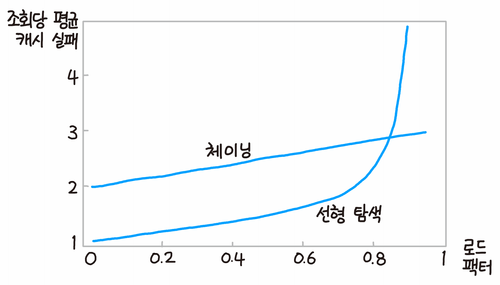

# 해시테이블

키와 값을 매핑하여 저장하는 자료구조. 데이터를 찾을 때 매우 빠른 접근.
즉, 어떤 물건의 시그니처를 통해 어디에 보관할지 결정하는 자료구조.

## 1. 핵심 원리: 해시 함수
임의의 길이를 갖는 임의의 데이터를 고정된 길이의 데이터로 매핑하는 단방향 함수.
입력값이 같을때 언제나 유니크한 아웃풋이 나오는 것.
어떤 객체(값)를 유니크한 정수로 만드는 함수.

* 어떤 숫자를 10으로 나누고 그 나머지를 구하는 함수도 해시 함수이다. 나머지는 0~9로 일정한 길이를 갖기 때문이다.
* 이러한 해시 함수를 적용하여 나온 고정된 길이의 값을 해시값, 해시 코드, 해시섬, 체크섬(지금 생각해보니 체크섬도 %연산을 사용했다) 등으로 부른다.


* 1 키 입력: 사용자가 특정 키(예: 사과) 제공
* 2 해시 함수 변환: 해시 함수가 키를 받아 해시 코드(정수)로 변환
* 3 인덱스 계산: 이 해시 코드를 배열의 크기로 나눈 나머지 연산을 통해 특정 인덱스(주소) 결정
* 4 저장: 해당 인덱스 위치에 데이터 저장


## 2. 장점

* 1 검색 속도: 데이터를 찾을 때 키를 해시 함수에 넣어 바로 위치를 찾음 O(1).
* 2 효율: 데이터 양이 늘어나도 검색 속도를 일정하게 유지함.

## 3. 해시 충돌과 해결:
서로 다른 키가 해시 함수를 거쳤는데 동일한 인덱스가 나오는 경우.

* 1 체이닝: 같은 주소에 데이터를 여러 개 저장할 수 있도록 연결 리스트를 사용. 그러나 이 경우에는 검색 속도가 O(1)이 아니게 되겠음.
* 2 개방 주소법(Open Addressing): 충돌이 나면 비어 있는 다른 주소를 찾아 데이터 삽입. (예: 바로 다음 칸을 확인하는 ‘선형 탐색’)



```cpp
template <class T>
class HashMap
{
private:
	struct Node
	{
		std::string key;
		T value;
	};

	const int HashFunction(const std::string key) const
	{
		long hash = 0;
		for (char c : key)
		{
			hash += (hash * 16)+c;
		}
		return hash % m_size;
	}

	mutable size_t m_size;
	mutable std::vector<std::list<Node>> m_table; // 필요하다면 자동 확장하도록
public:
	explicit HashMap(size_t size)
		: m_size(size), m_table(size)
	{

	}
	~HashMap() {}

	int Get(std::string key, T& out) const
	{
		int idx = HashFunction(key);
		for (Node& node : m_table[idx])
		{
			if (node.key == key)
			{
				out = node.value;
				return 1;
			}
		}
		return -1;
	}

	int Insert(std::string key, int value)
	{
		int idx = HashFunction(key);
		for (Node& node : m_table[idx])
		{
			if (node.key == key)
				return -1;
		}
		m_table[idx].push_back({key, value});
		return 1;
	}

};
```