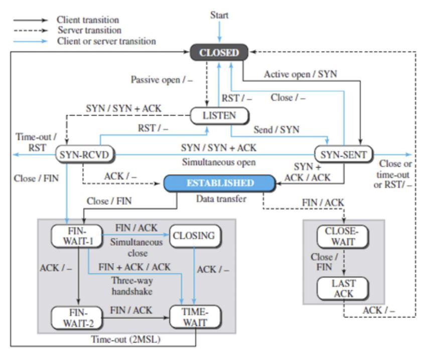

# L4
## 목차
> [1. TCP 서비스 개요(특징)](#1-tcp-서비스-개요-특징)
[├── 1.1. 버퍼 개요](#11-버퍼)
[├── 1.2. 세그먼트 개요](#12-세그먼트-개요)
[├── 1.3. 전이중 통신](#13-전이중-통신)
[├── 1.4. 연결 지향 및 신뢰성](#14-연결-지향-및-신뢰성)
[├── 1.5. 번호화 시스템](#15-번호화-시스템)
[│ ` `├── 1.5.1. 바이트 번호](#151-바이트-번호)
[│ ` `├── 1.5.2. 순서 번호 SEQ](#152-순서-번호-seq-number)
[│ ` `└── 1.5.3. 확인 응답 번호 ACK](#153-확인응답-번호-ack-number)
[├── 1.6. 흐름 제어 개요](#16-흐름-제어-개요)
[├── 1.7. 오류 제어 개요](#17-오류-제어-개요)
[├── 1.8. 흐름 + 오류 제어](#18-흐름--오류-제어)
[├── 1.9. 혼잡 제어 개요](#19-혼잡-제어-개요)
[└── 1.10. TCP 윈도우 개요](#110-tcp-윈도우-개요)
[│ ` `├── 1.10.1. 송신 윈도우](#1101-송신-윈도우)
[│ ` `└── 1.10.2. 수신 윈도우](#1102-수신-윈도우)

> [2. 세그먼트](#2-세그먼트)

---

## 1. TCP 서비스 개요 (특징)

TCP는 스트림 기반의 프로토콜이다.

### 1.1. 버퍼 개요
* 송신 버퍼와 수신 버퍼를 구현하는 방법 중 하나는 1바이트 단위의 위치를 갖는 순환 배열이다. 

* 송신 버퍼에 있는 공간의 상태는 빈 공간, 전송되었지만 확인응답되지 않은 바이트, 전송할 바이트로 나타낼 수 있다. 수신 프로세스가 데이터를 느리게 소비하거나 망에서 혼잡이 발생하는 경우에는 전송할 바이트 중 일부만을 전송할 수 있다. 또한 확인응답되면 전송되었던 공간은 비워져서 송신 프로세스에 의해 사용될 수 있다. 이것이 순환 버퍼로 나타낸 이유이다.

* 수신 측에서의 버퍼는 빈 공간과 망으로부터 수신되었지만 아직 수신 프로세스가 읽지 않은 바이트로 나타낼 수 있다.

### 1.2. 세그먼트 개요

* 비록 버퍼를 이용하는 것이 생산과 소비 프로세스 간의 속도와 불일치를 처리하지만, 데이터를 전송하기 위해 IP는 바이트 스트림의 형태가 아닌 패킷의 형태로 데이터를 전달해야 한다. 
* TCP는 일련의 바이트를 세그먼트라고 하는 패킷으로 그룹화하고 IP계층에 이러한 세그먼트를 배달한다. 이 세그먼트는 IP 데이터그램으로 캡슐화되어 전송된다. 이러한 전반적인 동작은 수신 프로세스에 투명하게 이루어지는데, 세그먼트들이 순서에 어긋나게 수신되거나, 없어지거나 또는 훼손되고 재전송되는 것을 볼 수 있다. 
* 이러한 모든 일들은  TCP에서 처리되어 수신 프로세스는 TCP의 동작에 대해서 알 필요가 없다.


### 1.3. 전이중 통신

데이터를 동시에 양방향으로 전송할 수 있다. *(full-duplex)*

### 1.4. 연결 지향 및 신뢰성

* 두 TCP 간에 가상 연결이 설정되고, 양방향으로 데이터가 교환된 후 연결이 종료된다. 여기에서 TCP 간의 연결은 실제의 물리적인 연결이 아니라 가상의 연결이다. 
* TCP 세그먼트는 IP 데이터그램으로 캡슐화되어 순서에 어긋나거나 손실되거나 훼손되고 재전송 될 수 있다.
* 각각의 세그먼트가 서로 다른 경로를 거쳐서 목적지에 도달할 수 있다. 즉, **실제의 물리적인 연결은 없다**. 그렇지만 TCP는 스트림 기반의 환경을 제공하여 상대방에게 순서에 맞게 바이트를 전달할 책임이 있다.

* TCP는 신뢰성 있는 전송 프로토콜이다. 데이터가 안전하고 오류 없이 잘 도착했는지를 확인하기 위하여 **확인응답(ACK) 메커니즘**을 이용한다.
<br>
### 1.5. 번호화 시스템

TCP소프트웨어는 어떤 세그먼트를 전송 또는 수신했는지를 기억하지만, 세그먼트 헤더에는 세그먼트 번호 값을 위한 필드는 없다. 대신 순서 번호와 확인응답 번호의 두 개의 필드가 존재한다. 이 두 개의 필드는 세그먼트 번호가 아닌 바이트의 번호와 관련이 있다.
<br>
##### 1.5.1. 바이트 번호

각 방향으로 전송되는 데이터 바이트는 TCP에 의해 번호가 매겨진다. 번호는 임의로 생성된 값에서 시작된다.

TCP는 한 연결에서 전송되는 모든 데이터 바이트에 번호를 매긴다. 이러한 번호는 각 방향에서 서로 독립적으로 매겨진다. TCP가 프로세서로부터 데이터 바이트를 수신하여 송신 버퍼에 보관하면, TCP는 각 바이트마다 번호를 매긴다. 

번호는 0부터 시작할 필요는 없다. 대신 TCP는 0에서 2^32-1사이의 임의의 값을 선택하여 처음 바이트의 번호로 설정한다. 예를 들어 임의의 값이 1557이고 전송하고자 하는 총 데이터가 6,000바이트라면, 1557부터 7557까지의 번호가 전송되는 바이트 각각에 매겨진다. 바이트 순서화는 흐름 및 오류 제어에서 사용된다.

##### 1.5.2. 순서 번호 SEQ number

바이트에 번호가 매겨지면 TCP는 전송하고자 하는 세그먼트에 하나의 순서 번호를 할당한다. 각 세그먼트의 순서 번호는 그 세그먼트에 있는 첫 번째 바이트의 번호로 설정된다.

데이터와 제어 정보(피기배킹) 조합을 운반하는 세그먼트는 순서 번호를 사용한다. 사용자 데이터를 전달하지 않는 세그먼트는 논리적으로는 순서 번호를 가질 필요는 없다. 필드는 있지만 값은 유효하지 않다. 그렇지만, 단지 제어 정보만을 포함하는 특별한 세그먼트는 순서 번호를 필요로 하며 수신측으로부터 확인응답된다. 이러한 세그먼트는 연결 설정, 해지, 또는 중단을 위해서 사용된다. 이 세그먼트 각각은 비록 실제의 데이터는 없지만, 마치 하나의 바이트를 전달하는 것과 같이 하나의 순서 번호를 소비한다.

##### 1.5.3. 확인응답 번호 ACK number

ACK number는 수신한 마지막 바이트번호에서 1을 더한 값을 공지한다. 물론 바이트 번호가 받은 총 바이트를 의미하지는 않는다.

TCP에서의 통신은 양방향으로 이루어진다. 연결이 설정되면 양측은 동시에 데이터를 송수신할 수 있다. 

각각의 TCP는 서로 다른 시작 번호를 이용하여 바이트에 순서를 매긴다. 각 방향으로 전송되는 세그먼트에 있는 순서 번호는 그 세그먼트에 의해서 운반되는 첫 번째 바이트의 번호를 보여준다. 

각 TCP는 또한 자신이 바이트를 수신했다는 것을 확인하여 주기 위해 확인응답 번호를 이용한다. 확인응답 번호는 자신이 수신하기를 기대하는 다음 바이트의 번호를 나타낸다. 

또한 확인응답 번호는 누적된다. 한쪽 편에서는 제대로 수신한 마지막 바이트의 번호에 1을 더한 값을 확인응답 번호로 다른 편에 공지한다. 여기서 누적이란, 예를 들면 ACK번호를 1557을 사용했다면, 처음부터 1556까지의 모든 바이트를 수신했다는 것을 의미한다. 물론 이것이 1557바이트를 수신했다는 것을 의미하지는 않는다. 첫 번째 바이트의 번호는 0부터 시작되지 않고 2^32-1까지의 임의의 수로 결정되기 때문이다.
<br>

### 1.6. 흐름 제어 개요

정보의 **생성율**과 **소비율** 간에는 **균형**이 이루어져야 한다. 너무 빨리 생성되면 손실될 수 있고, 너무 느리게 생성되면 시스템이 덜 효율적일 것이다. 흐름 제어는 소비자 측에서 데이터 정보의 손실을 방지하기 위한 기능이다. 

소비자로부터 선 요구 없이 정보가 생성될 때 마다 전송 측에서 정보를 전달하는 경우를 **밀기(pushing)**, 소비자가 요구한 경우에만 정보를 전달하는 경우는 **끌기(pulling)**라고 한다. 생산자가 밀기 방식으로 정보를 전달하게 되면, 소비자는 정보의 과도한 수신에 직면할 수 있고, 정보의 손실을 방지하기 위해 반대 방향으로 흐름 제어가 필요하게 된다. 소비자는 전송을 중지하도록 생산자에게 경고하고 또한 자신이 정보를 다시 수신할 준비가 되면 생산자에게 알려줄 필요가 있다. 끌기 방식에서는 소비자가 수신할 준비가 되면 생산자에게 요청하기 때문에 흐름제어는 필요 없다.

**송신 프로세스**는 메시지를 생산하고 **밀기 방식으로 전송 계층으로 전송**한다. **송신 전송 계층**은 **생산자와 소비자 두 가지 임무**를 수행한다. 
* **소비:** L7에서 전송받은 메시지를 소비.
* **생산:** 메시지를 패킷으로 캡슐화하여 밀기를 통해 상대측 수신 전송 계층으로 전송.

수신 전송 계층도 두 가지 임무를 가지고 있다. 즉, 송신측으로부터 전송된 패킷을 소비하고 메시지를 역캡슐화하여 L7으로 배달한다. 하지만 마지막 배달은 끌기로 이루어진다. 즉, **전송 계층은 응용 계층 프로세스가 메시지를 요청하기 전까지는 기다린다.**

비록 여러 가지 방법으로 흐름 제어가 구현될 수 있지만, 한 가지 방법은 일반적으로 송 수신 측의 버퍼 하나씩을 이용하는 것이다. 수신 전송 계층의 버퍼가 가득 차면, 수신 전송 계층은 패킷의 전송을 멈추도록 송신 전송 계층에게 알린다. 버퍼에 빈 공간이 생기면, 수신 전송 계층은 송신 전송 계층에게 메시지를 다시 전송해도 된다고 알린다. ~~수신이 이를 알리는건 실제론 사용되지 않는 방식임~~

**송신 TCP**는 송신 프로세스로부터 **수신되는 데이터의 양을 조절**하며, **수신 TCP**는 송신 TCP로부터 **전송되는 데이터의 양을 조절**한다. 이것은 수신측에서 데이터가 과도하게 수신됨으로 인한 데이터의 손실을 방지하기 위한 것이다. TCP는 **바이트단위의 흐름 제어**를 위하여 **번호화 시스템을 이용**한다.


### 1.7. 오류 제어 개요

인터넷에서는 송신 전송 계층으로부터 수신 전송 계층으로 패킷을 전달할 책임이 있는 하부의 네트워크 계층(IP)이 신뢰성을 제공하지 않기 때문에, 응용 계층에서 신뢰성을 요구하는 경우에는 **전송 계층에서 신뢰성을 제공할 수 있어야 한다.** 전송 계층의 오류 제어에서 제공되는 기능은 다음과 같다.

- **i)** 훼손된 패킷의 감지 및 폐기
- **ii)** 손실되거나 제거된 패킷을 추적하고 재전송
- **iii)** 중복 수신 패킷을 확인하고 폐기
- **iv)** 손실된 패킷이 도착할 때까지 순서에 어긋나게 들어온 패킷을 버퍼에 저장

흐름 제어와는 다르게 오류 제어에는 전송계층들만이 관여한다. 응용 계층과 전송 계층 간에 교환되는 메시지에는 오류가 없다고 가정한다. 
<br>

##### 1.7.1. 순서 번호 활용 

오류 제어가 수행되기 위해서 송신 전송 계층은 어떤 패킷이 재전송되어야 하는지를 알아야 하며, 어떤 수신 전송 계층은 어떤 패킷이 중복되었는지 또는 어떤 패킷이 순서에 어긋나게 도착했는지를 알아야 한다. 

이러한 것은 패킷이 번호를 가지고 있으면 가능하다. 이는 패킷의 순서 번호를 저장할 수 있도록 전송 계층 패킷에 한 필드를 추가하는 것이다. 만일 패킷이 훼손되거나 손실되었으면, 수신 계층은 어떻게 해서든지 송신측에게 순서 번호를 가진 해당 패킷을 재전송하도록 알려줄 수 있다. 

또한 수신한 두 개의 패킷이 동일한 순서 번호를 가진 경우 중복 수신을 감지할 수 있다. 순서 번호의 간격을 관찰함으로써 패킷이 순서에 어긋나게 들어왔는지도 확인할 수 있다. 
<br>

##### 1.7.2. 확인 응답 ACK 활용

오류 제어를 위하여 긍정과 부정 신호 모두가 사용될 수 있다. 수신측에서는 오류 없이 잘 수신된 패킷들에 대해서 확인응답을 전송할 수 있다. 수신측은 훼손된 패킷을 단순히 버린다. 이 때 송신측에서 타이머를 사용하는 경우에는 패킷의 손실을 감지할 수 있다. 패킷을 전송한 후 송신측은 타이머를 구동하고, 타이머가 만료되기 전까지 ACK가 도착하지 않으면 송신측은 패킷을 재전송한다

신뢰성 있는 서비스를 위해 TCP는 오류 제어 메커니즘을 구현한다. 오류 제어에서는 세그먼트가 오류 감지를 위한 데이터의 단위이기는 하지만, 오류 제어는 바이트단위로 동작한다.

<br>

### 1.8. 흐름 + 오류 제어
송신측과 수신측의 버퍼에 번호가 매겨지면 흐름 제어 기능과 오류 제어 기능이 결합될 수 있다. 전송할 패킷이 있는 송신측은 패킷의 순서 번호로서 버퍼 내의 비어있는 영역의 제일 앞 부분의 번호인 x를 사용한다. 패킷이 전송되면 패킷의 복사본은 메모리 영역 x에 저장되며 상대방으로부터의 확인응답을 기다린다. 전송된 패킷에 대한 ACK 이 도착하면 패킷은 제거되고 메모리 영역은 비워진다. 수신측에 순서 번호 y를 갖는 패킷이 도착하면, 수신측은 응용 계층에서 수신할 준비가 되기 전까지는 수신된 패킷을 메모리 영역 y에 저장한다. 그리고 패킷 y의 도착을 알리기 위해 ACK을 전송한다.
<br>

##### 1.8.1. 슬라이딩 윈도우

순서 번호가 modulo 2^m을 사용하기 때문에, 0부터 2^m-1 까지의 순서 번호를 원형으로 표현할 수 있다(현재 헤더의 순서번호 필드는 32비트. 즉, m = 32). 버퍼는 슬라이딩 윈도우라고 하는 일련의 조각으로 표현되며, 각 조각들은 언제나 원형의 일부분을 점유한다. 송신측에서 패킷이 전송되면 관련 조각이 마크된다.

모든 조각이 마크된다는 것은 버퍼가 다 차서 더 이상의 메시지를 L7에서 수신할 수 없다는 것을 의미한다. ACK가 수신되면 해당 조각의 마크는 해제된다. 윈도우의 시작부터 몇 개의 연속적인 조각의 마크가 해제되면, 윈도우의 끝에서 좀 더 많은 빈 조각을 허용하기 위해 윈도우를 관련 순서 번호의 범위를 미끄러지듯이 돌린다. 

대부분의 프로토콜에서는 선형 표현 방식을 이용해 슬라이딩 윈도우를 보여준다. 이 아이디어는 더 작은 공간을 이용해 슬라이딩 윈도우를 동일하게 표현할 수 있다.


### 1.9. 혼잡 제어 개요

혼잡은 네트워크로 전송되는 패킷의 수를 나타내는 네트워크의 로드가 네트워크에서 처리할 수 있는 패킷의 수를 나타내는 네트워크의 용량을 초과하는 경우에 혼잡이 발생한다. 혼잡은 대기를 포함하는 어떠한 시스템에서도 발생한다. 예를 들어 혼잡 시간 동안에 사고와 같은 비정상적인 상황으로 인하여 정체가 발생하는 고속도로에서도 혼잡은 발생한다.

네트워크나 인터넷에서의 혼잡은 라우터나 스위치가 패킷을 저장하기 위한 버퍼인 큐를 가지고 있기 때문에 발생한다. 패킷은 적절한 출력 큐에 저장되며 자신의 순서가 되어 전송되기 전까지 기다린다. 이러한 큐의 용량은 유한하며 라우터가 저장할 수 있는 것보다 더 많은 패킷이 라우터에 들어올 수 있다. 혼잡 제어는 혼잡이 일어나지 않도록 미연에 방지하거나 또는 만일 발생하면 혼잡을 제거하기 위한 기술과 메커니즘을 말한다.

TCP는 망의 혼잡을 고려한다. 송신측에서 전송되는 데이터의 양은 흐름 제어에 의해 수신측에 의해서 조절될 뿐만 아니라 망의 혼잡 정도에 의해서도 결정된다.


### 1.10. TCP 윈도우 개요

TCP는 데이터 전송을 위한 각 방향에대해서 (송수신) 두 개의 윈도우를 사용하며 따라서 양방향 통신을 위해 네 개의 윈도우가 필요하다. 양방향 통신은 두 개의 단방향 통신과 피기배킹을 이용하면 유추할 수 있다. 윈도우는 여기서 간단히 하고 흐름 제어, 오류 제어, 혼잡 제어와 같은 문제를 다룰 때 더 자세히 설명한다.

#### 1.10.1. 송신 윈도우

송신 윈도우의 크기는 **수신자 (흐름 제어)**와 하부 네트워크의 **혼잡(혼잡 제어 cwnd)**에 의해서 조절된다. TCP의 윈도우는 바이트의 번호를 나타내는데, 비록 세그먼트 단위의 전송이 이루어지지만 윈도우를 제어하는 변수는 바이트로 표현된다. 또한 오류 제어를 위한 타이머도 하나만 사용한다.

#### 1.10.2. 수신 윈도우

TCP의 수신 윈도우에서는 응용 프로세스가 자신의 속도로 데이터를 읽어갈 수 있다. 이것은 수신측에 할당된 버퍼의 일부분은 수신되고 확인응답된 데이터로 채워져 있지만 수신 프로세스에서 읽어가기 전까지는 이러한 데이터는 버퍼에 저장되어 있어야 한다는 것을 의미한다. 수신 윈도우의 크기는 항상 버퍼의 크기보다 작거나 같다. 또한 수신 윈도우가 송신측으로부터 넘치지 않고(흐름 제어) 수신할 수 있는 바이트의 개수를 결정한다. 다시말하면, 일반적으로 rwnd라고 하는 수신 윈도우의 크기는 다음과 같이 결정될 수 있다.
``` rwnd = 버퍼 크기 - 읽히기를 기다리는 바이트 수 ```

---

## 2. 세그먼트

### 2.1. 형식

세그먼트는 20+@바이트의 헤더와 응용 프로그램으로부터 생성되는 데이터로 구성되어 있다.

* **i)** Source port address               16 bits
세그먼트를 전송하는 호스트에 있는 응용 프로그램의 포트 번호

* **ii)** Destination port address				16 bits
세그먼트를 수신하는 호스트에 있는 응용 프로그램의 포트 번호

* **iii)** Sequence number					32 bits
세그먼트에 포함된 데이터의 첫 번째 바이트에 부여된 번호

* **iv)** Acknowledgement number			32 bits
세그먼트를 수신한 수신 노드가 상대편 노드로부터 수신하고자 하는 바이트의 번호
확인응답과 데이터는 함께 피기백될 수 있다.

* **v)** 헤더 길이						4 bits
헤더의 길이는 20에서 60바이트가 될 수 있다. 따라서 이 필드는 5 ~ 15가 될 수 있다.
(5*4 = 20, 15*4 = 60)

* **vi)** 예약							6 bits
차후의 사용을 위해서 예약된 필드이다.

* **vii)** 제어						6 bits
서로 다른 6개의 제어 비트 또는 플래그를 나타낸다. 동시에 여러 개의 비트가 1로 설정될 수 있다. 이 비트들은 흐름 제어, 연결 설정 및 종료, 연결 리셋, 그리고 TCP에서의 데이터 전송 모드를 위해서 사용된다.
URG	ACK	PSH	RST	SYN	FIN
지금은 예약 필드를 소모하여 NS CWR ECE를 추가하였다. 이는 아래 그림에 반영한다.

* **viii)** 윈도우 크기					16 bits
바이트 형태의 송신 TCP의 윈도우를 나타낸다. 이 필드의 길이가 16비트이기 때문에 윈도우의 최대 크기는 65,535바이트 이다. 윈도우 크기는 수신 윈도우(rwnd: receiving window)라고 하며 수신측에 의해서 결정된다. 이 경우 송신측은 수신측의 지시에 따라야 한다.

* **ix)** 검사합						16 bits
TCP의 검사합은 UDP와 동일한 절차를 따른다. 하지만 UDP의 검사합 은 옵션인 반면, TCP에서는 필수 사항이다. UDP에서와 같은 동일한 목적을 수행하기 위하여 동일한 의사 헤더가 검사합 계산을 위하여 세그먼트에 추가된다.

* **x)** 긴급 포인터
긴급 플래그가 1로 설정되어 있는 경우에만 유효하다. 이 필드에 있는 값과 순서 번호를 더하면 세그먼트 데이터 부분에 있는 마지막 긴급 바이트의 번호를 알 수 있다.

* **xi)** 옵션
TCP는 최대 40바이트 까지의 옵션 정보가 있을 수 있다.

```
# a. Segment
+-+-+-+-+-+-+-+-+-+-+-+-+-+-+-+-+-+-+-+-+-+-+-+-+-+-+-+-+-+-+-+-+
| Header (20~60bytes) |           Payload(~1460bytes)           |
+-+-+-+-+-+-+-+-+-+-+-+-+-+-+-+-+-+-+-+-+-+-+-+-+-+-+-+-+-+-+-+-+

# b. Header
0                   1                   2                       3
 0 1 2 3 4 5 6 7 8 9 0 1 2 3 4 5 6 7 8 9 0 1 2 3 4 5 6 7 8 9 0 1
+-+-+-+-+-+-+-+-+-+-+-+-+-+-+-+-+-+-+-+-+-+-+-+-+-+-+-+-+-+-+-+-+
|       Source Port (16)        |    Destination Port (16)      |
+-+-+-+-+-+-+-+-+-+-+-+-+-+-+-+-+-+-+-+-+-+-+-+-+-+-+-+-+-+-+-+-+
|                       Sequence Number (32)                    |
+-+-+-+-+-+-+-+-+-+-+-+-+-+-+-+-+-+-+-+-+-+-+-+-+-+-+-+-+-+-+-+-+
|                    Acknowledgment Number (32)                 |
+-+-+-+-+-+-+-+-+-+-+-+-+-+-+-+-+-+-+-+-+-+-+-+-+-+-+-+-+-+-+-+-+
|HLEN    |R(3)|N|C|E|U|A|P|R|S|F|                               |
|(4)     |e   |S|W|C|R|C|S|S|Y|I|      Window Size (16)         |
|        |s   | |R|E|G|K|H|T|N|N|                               |
+-+-+-+-+-+-+-+-+-+-+-+-+-+-+-+-+-+-+-+-+-+-+-+-+-+-+-+-+-+-+-+-+
|        Checksum (16)          |     Urgent Pointer (16)       |
+-+-+-+-+-+-+-+-+-+-+-+-+-+-+-+-+-+-+-+-+-+-+-+-+-+-+-+-+-+-+-+-+
|                    Options (Variable)                         |
+-+-+-+-+-+-+-+-+-+-+-+-+-+-+-+-+-+-+-+-+-+-+-+-+-+-+-+-+-+-+-+-+
```
<br>

### 2.2. 캡슐화

TCP 세그먼트는 응용 계층으로부터 들어온 데이터를 캡슐화 한다. TCP 세그먼트는 IP 데이터그램 캡슐화 되며, 이는 또다시 데이터링크 계층의 프레임에 캡슐화된다.

---             

## 3. TCP 연결

TCP는 연결 지향 프로토콜이다. TCP의 연결은 실제가 아닌 가상이다. TCP는 상위 단계에서 동작한다. TCP는 수신측에게 각각의 세그먼트를 전송하기 위해 IP의 서비스를 이용하지만, TCP 자체에서 연결을 제어한다. 손실되거나 훼손된 세그먼트는 재전송된다. 

TCP와는 다르게 IP는 이와 같은 재전송을 알지 못한다. 만일 세그먼트가 순서에 어긋나게 도착하면 아직 도착하지 않은 세그먼트가 도착할 때 까지 TCP는 기존에 수신한 세그먼트를 보관하며, IP는 이러한 순서의 재정렬에 대해서는 알지 못한다. TCP에서 연결 지향 전송은 연결 설정, 데이터 전송, 연결 종료의 세 가지 단계를 통해 이루어진다.

### 3.1. 연결 설정

TCP는 전 이중(full-duplex) 방식으로 데이터를 전송한다. 두 기기에 있는 두 개의 TCP가 연결되면, 그들은 동시에 서로 세그먼트를 주고받을 수 있다. 

TCP에서의 연결 설정은 3단계 핸드쉐이킹(three-way handshaking)라고 한다. 이 절차에서 클라이언트라고 하는 응용 프로그램은 서버라고 하는 또 다른 응용 프로그램과 전송 계층 프로토콜인 TCP를 이용하여 연결을 설정하고자 한다. 3단계 핸드쉐이크 절차는 서버에서부터 시작한다. 

서버 프로그램은 자신의 TCP에게 연결을 수락할 준비가 되어 있다는 것을 알린다. 이러한 요청을 수동 개방(passive open. listen?)이라고 한다. 비록 서버 TCP가 다른 시스템으로부터 어떠한 연결도 수락할 수 있지만, 자신이 먼저 연결을 개설할 수는 없다.

클라이언트 프로그램은 능동 개방(active open. connect?)을 위한 요청을 실행한다. 개발되어 있는 서버와 연결을 설정하고자 하는 클라이언트는 자신의 TCP에게 특정한 서버와 연결을 설정할 것이라는 것을 알린다. 


**3-way handshaking**
이제 TCP는 3단계 핸드쉐이킹 절차를 시작한다.
```
3-way handshaking

      [Client]                                         [Server]
         |                                                |
         |  1. SYN (seq=x)                                |
         |----------------------------------------------->|
         |                                                |
         |  2. SYN+ACK (seq=y, ack=x+1)                   |
         |<-----------------------------------------------|
         |                                                |
         |  3. ACK (seq=x+1, ack=y+1)                     |
         |----------------------------------------------->|
         |                                                |
      [ESTABLISHED]                                  [ESTABLISHED]
```
**[연결 절차 1] 클라이언트의 SYN**

클라이언트는 첫 번째 세그먼트로서 SYN 플래그가 1로 설정된 SYN 세그먼트를 전송한다. 이 세그먼트는 순서 번호의 동기화가 목적이다. 

클라이언트는 임의의 값을 첫 번째 순서 번호로 선택한 후 이 번호를 서버로 전송한다. 이 순서 번호를 초기 순서 번호(ISN: initial sequence number)라고 한다. 이 세그먼트에는 ACK number가 포함되지 않는다. 또한 윈도우 크기도 정의되지 않는다. 윈도우 크기 필드에 있는 값은 세그먼트가 ACK number를 포함하는 경우에만 의미가 있다.

SYN 세그먼트는 데이터를 전달하지는 않지만 하나의 순서 번호를 소비한다. 데이터 전송이 시작되면 순서 번호는 1만큼 증가한다. 즉, SYN 세그먼트는 실제 데이터를 전달하지 않지만 하나의 가상 바이트를 포함하고 있다고 생각해도 좋다.

**[연결 절차 2] 서버의 SYN | ACK**

서버는 두 번째 세그먼트로서 SYN와 ACK 플래그 비트가 각각 1로 설정된 SYN+ACK세그먼트를 전송한다. 이 세그먼트는 두 가지 목적을 가지고 있다. 

첫 번째로, 이 세그먼트는 반대 방향으로의 통신을 위한 SYN 세그먼트이다. 서버는 서버로부터 클라이언트로 전송되는 바이트의 순서활을 위한 순서 번호를 초기화하기 위하여 이 세그먼트를 사용한다. 

두 번째는, 클라이언트로부터의 SYN에 대한 응답이다. ACK 플래그를 1로 설정하고 클라이언트로부터 수신하기를 기대하는 다음 순서 번호를 표시함으로써 클라이언트로부터의 SYN 세그먼트 수신을 확인응답한다. 이 세그먼트는 ACK number를 포함하고 있으며, 흐름 제어를 위한 클라이언트에 의해 사용되면 수신 윈도우 크기인 rwnd를 포함한다.

SYN+ACK 세그먼트는 데이터를 전달하지는 않지만 하나의 순서 번호를 소비한다. 또한 윈도우 크기도 통지한다.

**[연결 절차 3] 클라이언트의 ACK**

클라이언트는 세 번째 세그먼트를 전송한다. 이것은 단순히 ACK 세그먼트이다. 이 세그먼트는 ACK 플래그와 확인응답 번호 필드를 이용해 두 번째 세그먼트의 수신을 확인한다. 

이 세그먼트에 있는 순서 번호는 SYN 세그먼트에 있는 것과 동일한 값으로 설정된다. 왜냐하면 ACK 세그먼트는 순서 번호를 소비하지 않기 때문이다. 

클라이언트는 또한 서버의 윈도우 크기를 결정해야 한다. 어떤 구현에서는 연결 단계에 있는 이러한 세 번째 세그먼트에 클라이언트로부터 들어온 데이터들을 포함하여 전달할 수 있다. 이 경우, 세 번째 세그먼트는 데이터의 첫 번째 바이트의 바이트 번호를 나타내는 새로운 순서 번호를 가지고 있어야 한다.

> **번외: SYN 플러딩 공격**
>
>TCP의 연결 설정 과정은 SYN 플러딩 공격이라는 중요한 보안 문제에 노출되어 있다. 이 공격은 공격자가 데이터그램의 발신지 IP주소를 위조함으로써 다른 클라이언트로 가장한 후에 많은 수의 SYN 세그먼트를 하나의 서버에 전송하는 경우에 발생한다. 
> 
> 서버는 클라이언트가 능동 개방을 요청했다고 가정하고 TCP 테이블을 만들고 타이머를 설정하는 등의 필요한 자원을 할당한다. 그런 후에 TCP 서버는 위조된 클라이언트에게 SYN+ACK 세그먼트를 전송하며, 이 세그먼트는 없어질 것이다. 하지만 TCP 서버가 핸드 셰이크의 세 번째 단계를 기다리는 동안에 자원들은 사용되지 않는 상태로 할당되어 있을 것이다. 이 짧은 시간 동안 전송되는 SYN 세그먼트의 수가 많으면 서버는 궁극적으로 자원을 다 소비하게 되어 유효한 클라이언트로부터 들어오는 연결 요청을 받아들이지 못하게 될 것이다. 
>
> 이러한 공격은 서비스 거부 공격이라고 하는 보안 공격의 일종이며, 공격자가 시스템에서 많은 서비스를 요구함으로써 시스템에 과부하가 걸리고 따라서 유효한 요청에 대해서 서비스를 거부하도록 함으로써 시스템을 독점한다.
>
> TCP에서는 SYN 공격의 영향을 경감하기 위하여 몇 가지 방법을 사용하기도 한다. 즉, 미리 정해진 시간동안 들어오는 연결 요구의 수를 제한하는 방법을 사용하기도 하고, 또한 원하지 않는 발신지 주소로부터 들어오는 데이터그램을 여과해서 제거하는 방법도 있다. 최근에 사용되는 한 가지 방법은 쿠키를 이용해 전체 연결이 설정되기 전까지 자원의 할당을 연기하는 것이다. 이러한 전략은 SCTP 프로토콜이 사용한다.


### 3.2. 데이터 전송

연결이 설정된 후에는 양 방향으로 데이터가 전송될 수 있다. *(클라이언트와 서버는 양 방향으로 데이터 확인응답을 전송할 수 있다.)* 

동일한 방향으로 전송되는 데이터와 확인응답은 하나의 세그먼트로 전달될 수 있다. 이를 **피기배킹PiggyBacking**이라고 한다. 

클라이언트로부터 전송되는 데이터 세그먼트에는 PSH 플래그가 1로 설정되어 있는데, 이는 TCP로 하여금 세그먼트가 도착하는 대로 서버 프로세스로 배달될 수 있도록 알려준다. 대부분의 TCP 구현에는 이 플래그를 설정할지 안할지에 대한 옵션이 있다. 
지금은 L7에서의 send(송신 TCP 버퍼에 담기)의 단위에 PSH가 붙고 있으며, winsock의 recv의 블로킹 상태를 해제하는 신호로 사용된다.

> **번외: 푸싱 데이터**
>
> 송신 TCP는 송신 응용 프로그램으로부터 들어오는 데이터 스트림을 저장하기 위하여 버퍼를 이용한다. 송신 TCP는 세그먼트의 크기를 선택할 수 있다. 수신 TCP 역시 수신한 데이터를 저장하기위한 버퍼를 가지고 있으며, 응용 프로그램이 수신할 준비가 되어 있을 때 데이터를 응용 프로그램으로 전달한다. 이러한 신축성이 TCP의 효율을 향상시킨다.
>
> 그러나 때때로 이러한 신축성이 편리하지 않은 응용 프로그램이 있다. 예를 들어 키보드의 입력을 즉시 전송하고 즉시 확인응답을 수신하고자 한다. 이러한 프로그램은 송신 TCP에서 네트워크로의 데이터 전송을 지연하거나 수신 TCP에서 수신 응용 프로그램으로의 전달을 지연하는 것은 받아들일 수 없을 것이다. TCP 에서는 이러한 상황을 처리할 수 있다. 
>
> 전송 측에 있는 응용 프로그램은 푸시 동작을 요구할 수 있다. 이것은 송신 TCP가 윈도우가 다 찰때까지 기다리지 않는 다는 것을 의미한다. 송신 TCP는 세그먼트를 만들어서 즉시 전송해야 한다. 송신 TCP는 또한 푸쉬 비트를 1로 설정하여 수신 TCP에게 세그먼트가 가능한 빨리 수신 응용 프로그램으로 전달되어야 하는 데이터를 포함하고 있다는 것을 알려주고, 따라서 수신 TCP가 더 이상의 데이터가 오기를 기다리지 않고 바로 수신 응용 프로그램으로 전달할 수 있도록 한다. 
>
> 비록 푸시 동작은 응용 프로그램에 의해 지시될 수 있지만, 현재의 대부분의 TCP 구현에서는 이러한 요구를 무시한다. TCP는 이러한 동작의 여부를 선택할 수 있다. 

> **번외2: 긴급 데이터**
>
> TCP는 스트림 지향 프로토콜이다. 이것은 데이터는 바이트 스트림의 형태로 응용 프로그램으로부터 TCP로 전달된다는 것을 의미한다. 데이터의 각 바이트는 스트림 내에서 위치를 가지고 있다. 그러나 응용 프로그램이 긴급(urgent) 바이트를 전송할 필요가 있을 때가 있다. 이것은 일부 데이터를 수신 응용 프로그램이 순서에 어긋나게 읽었으면 한다는 것을 의미한다.
>
>송신 응용 프로그램은 송신 TCP에게 데이터의 일부분이 긴급하다는 것을 알린다. 송신 TCP는 세그먼트의 시작에 긴급 데이터를 넣고 세그먼트를 만들고 URG 비트를 1로 설정한다. 세그먼트의 나머지 부분에는 버퍼로부터의 일반 데이터가 포함될 수 있다. 헤더에 있는 긴급 포인터 필드는 긴급 데이터의 끝과 일반 데이터의 시작을 표시한다. 수신 TCP가 URG 비트가 1로 설정된 세그먼트를 수신하면, 수신 TCP는 이 상황을 수신 응용에게 알린다. 수신측에서 어떻게 처리할 것인가는 운영 체제의 소관이다.
>
>TCP의 긴급 데이터는 우선순위 서비스 또는 신속 데이터 서비스를 제공하는 것은 아니다. 송신측의 응용 프로그램이 수신 측의 응용 프로그램으로부터 특별한 처리가 필요하다고 판단할 때 바이트 스트림의 일부 부분에 표시를 하는 서비스이다. 긴급 데이터는 TCP 바이트 스트림의 다른 데이터들과 동일하게 처리된다. 수신측 응용 프로그램은 긴급 모드가 사용되는지에 대해서 상관없이 수신된 순서대로 정확하게 데이터를 읽어야 한다. 표준 TCP는 어떠한 데이터도 순서에 어긋나게 데이터를 배달하지 않는다.

---

### 3.3. 연결 종료

데이터를 교환하는 어느 쪽도 연결을 종료할 수 있지만, 일반적으로는 클라이언트에서 종료를 시작한다. 현재의 대부분의 구현에서는 연결 종료를 위하여 3단계 핸드쉐이크와 반-닫기(half-close) 옵션을 가진 4단계 핸드쉐이크 등의 2가지 옵션이 사용된다.


#### 3.3.1. 반-닫기(half-close):
윈도우즈에서는 4way handshaking을 하고있기 때문에 반-닫기만 기록한다.

TCP에서는 한 쪽에서 데이터를 수신하면서 데이터 전송을 종료할 수 있다. 이를 반-닫기라고 한다. 

서버나 클라이언트 어느 쪽에서도 반-닫기 요청을 시작할 수 있다. 이것은 서버에서 모든 데이터를 수신한 후에 처리가 시작되는 경우에 발생할 수 있다. 정렬은 반-닫기의 좋은 예이다. 클라이언트가 정렬을 필요로 하는 데이터를 서버로 보내는 경우에, 서버는 클라이언트로부터 모든 데이터를 수신한 후에야 비로소 정렬을 시작할 것이다. 즉, 클라이언트는 모든 데이터를 전송한 후 전송 방향의 연결을 종료하지만, 정렬된 데이터를 수신하기 위하여 수신 방향은 개방된 상태로 남겨 놓는다. 서버는 모든 데이터를 다 수신하더라도 데이터를 정렬하는 데에는 시간이 걸릴 것이며, 서버의 전송 방향은 연결 상태를 유지해야 한다.

데이터를 포함하지 않는 FIN+ACK 세그먼트는 하나의 순서 번호를 소비한다.
클라이언트는 FIN 세그먼트를 전송함으로써 연결을 반-닫기 한다. 서버는 ACK 세그먼트를 전송함으로써 반-닫기를 수락한다. 그렇지만, 서버는 여전히 데이터를 전송할 수 있다. 서버가 처리된 모든 데이터를 전송한 후에는 FIN 세그먼트를 전송할 것이며, 이 세그먼트는 클라이언트로부터 전송되는 ACK에 의해 확인응답될 것이다.


#### 3.3.2. 상태 천이 다이어그램 Finite State Machine (서버+클라, 반 닫기)





연결 설정, 연결 종료, 그리고 데이터 전송 기간 동안 발생하는 여러 가지의 이벤트들을 관리하기 위해 TCP 소프트웨어는 위 그림과 같이 FSM을 이용하여 구현된다. 이 그림은 클라이언트와 서버를 위한 두 개의 FSM이 하나의 다이어그램에 포함되어 있다. 

타원은 상태를 나타낸다. 
한 상태에서 다른 상태로의 천이는 지시 선으로 표시되어 있다. 
각 선에는 사선(/)으로 나누어지는 두 개의 문자열이 있다. 
첫 번째 문자열은 TCP가 수신하는 입력을 나타내고, 두 번째 문자열은 TCP가 전송하는 출력을 나타낸다. 
검은색의 점선은 서버가 겪는 천이를 보여준다. 
또한 실선은 클라이언트가 겪는 천이를 보여준다. 
그렇지만 어떤 경우에는 서버가 실선 방향으로 천이하거나 클라이언트가 점선 방향으로 천이하기도 한다. 
컬러 선은 비정상적인 상황을 나타낸다.
ESTABLISHED로 표시된 타원은 사실 클라이언트를 위한 조합과 서버를 위한 조합의 두 조합의 상태이며 흐름 제어와 오류 제어를 위해 사용된다.


TCP의 상태 리스트는 다음과 같다.

| 상태 | 설명 |
| --- | --- |
| CLOSED | 연결이 존재하지 않는다. |
| LISTEN | 수동적으로 개방한다. SYN을 기다린다. |
| SYN_SENT | SYN을 보냈다. ACK을 기다린다. |
| SYN_RCVD | SYN+ACK를 보냈다. ACK을 기다린다. |
| ESTABLISHED | 연결이 생성됐다. 데이터를 전송할 수 있다. |
| FIN-WAIT-1 | 첫 FIN을 보냈다. ACK를 기다린다.|
| FIN-WAIT-2 | 첫 FIN에 대한 ACK를 받았다. 두 번째 FIN을 기다린다. |
| CLOSE-WAIT | 첫 FIN을 받고 ACK을 보냈다. 어플?의 종료를 기다린다(close 명령을 기다린다.). |
| TIME-WAIT | 두 번째 FIN을 받고 ACK을 보냈다. 동일 포트와 주소에 커넥션이 생성되지 않도록 2MSL timeout을 기다린다. |
| LAST-ACK | 두 번째 FIN을 보냈다. ACK을 기다린다. |
| CLOSING | 양 측에서 닫기로 결정한 상황이다. |

```
[Client]                                         [Server]
         |                                                |
         | (ESTABLISHED)                                  | (ESTABLISHED)
         |                                                |
         |  1. FIN (seq=x)                                |
  FIN_WAIT_1 -------------------------------------------->|
         |                                                | CLOSE_WAIT
         |  2. ACK (ack=x+1)                              |
  FIN_WAIT_2 <--------------------------------------------|
         |                                                |
         |  (서버가 남은 데이터 전송 완료)                  |
         |                                                |
         |  3. FIN (seq=y)                                |
  TIME_WAIT <---------------------------------------------| LAST_ACK
         |                                                |
         |  4. ACK (ack=y+1)                              |
         |----------------------------------------------->|
         |                                                | CLOSED
    (2 MSL 대기)                                          |
         |                                                |
       CLOSED                                             |
```
<br>

#### 3.3.3. 반닫기 시나리오

**클라이언트의 경우**
MSL은 Maximum Segment Lifetime으로, 세그먼트가 버려지기 전에 인터넷에서 살아남을 수 있는 최대 시간이다. TCP 세그먼트는 IP패킷으로 캡슐화되면서 TTL을 갖기 때문이다. 보통 30초에서 1분 사이의 값인데, TIME-WAIT의 타이머 값은 MSL의 2배의 값으로 설정된다. 이들이 필요한 이유는 두 가지가 있다.

* **이유1:** 마지막 ACK 세그먼트가 없어지면, 마지막 FIN에 대한 타이머를 설정한 서버 TCP는 자신의 FIN 세그먼트가 없어졌다고 간주하고 그 세그먼트를 재전송한다. 만일 클라이언트가 CLOSED 상태에 들어가서 2MSL 타이머가 만료되기 전에 연결을 종료하면, 클라이언트는 재전송된 FIN 세그먼트를 수신하지 못할 것이고 결과적으로 서버는 마지막 ACK을 수신하지 못할 것이다.

* **이유2:** 만약 같은 소켓 주소에서 연결을 끊었다가 곧바로 다시 생성되면 이전 연결에서 전송된 세그먼트가 새 연결의 세그먼트로 간주될 수도 있다. 


**서버의 경우**
다이어그램과 상태 리스트로 충분히 유추할 수 있다.

<br>

#### 3.3.4. 연결 거절 시나리오

서버 TCP가 연결을 거절하는 일반적인 상황은 SYN 세그먼트에 있는 목적지 포트가 현재 LISTEN이 아닐 때이다. SYN 세그먼트를 수신한 서버 TCP는 SYN 세그먼트를 확인응답하며 동시에 RST를 전송한다(SYN+RST). 이후 또 다른 연결을 기다리기 위해 . LISTEN 상태로 들어간다.
<br>

#### 3.3.5. 연결 중단 시나리오

프로세스는 연결을 종료하는 대신 중단할 수 있다. 이것은 프로세스에 고장이 발생하거나 버퍼에 있는 데이터를 전송하고 싶지 않은 경우에 발생한다. 또한 TCP가 연결을 중단하고자 할 수도 있다. 이 것은 TCP가 이전 연결에 속하는 세그먼트를 수신하는 경우에 발생한다. 

이러한 모든 경우에 TCP는 연결을 중단하기 위해 RST 세그먼트를 전송한다. 클라이언트 TCP는 RST+ACK세그먼트를 전송하고 버퍼에 있는 모든 데이터를 버린다. 서버 TCP도 버퍼에 있는 모든 데이터를 버리고, 에러 메세지를 통해 서버 프로세스에게 알린다. 양쪽의 TCP 모두는 즉시 CLOSED 상태로 들어간다. 여기에서 명심해야 할 것은 **RST 세그먼트에 대한 응답으로 ACK 세그먼트가 만들어지지 않는다는 것이다.**
<br>

#### 3.3.6. 연결 리셋
한쪽 편에 있는 TCP는 RST(reset) 비트를 1로 설정함으로써 연결 요청을 거절하거나, 연결을 중단하거나, 휴지 상태에 있는 연결을 종료할 수 있다.

* **연결 거절**
한쪽의 TCP가 존재하지 않은 포트로 연결을 요청하는 경우를 가정해보면, 다른 쪽의 TCP는 요청을 거절하기 위해 RST 비트를 설정한 세그먼트를 전송한다.

* **연결 중단**
한 TCP는 비정상적인 상황의 경우에 설정되어 있는 연결을 중단할 수 있다. 이 경우 TCP는 연결을 종료하기 위하여 RST 세그먼트를 전송한다.

* **휴지 연결의 종료**
한 쪽의 TCP는 다른 편의 TCP가 오랜 시간동안 휴지 상태에 있다는 것을 확인한 후, 연결을 파기하기 위해 RST 세그먼트를 전송한다. 이 과정은 연결 중단과 동일하다.

---

## 4. 흐름제어

**흐름 제어**는 **생산자가 데이터를 만드는 속도**와 **소비자가 사용하는 속도**의 **균형을 맞추는 것**이다. 다시 말하면 **수신 TCP는 송신 TCP를 제어**하고, **송신 TCP는 송신 프로세스를 제어**한다. 수신 프로세스는 직접 데이터를 읽어가기 때문에(recv호출) 흐름 제어 피드백은 존재하지 않는다. 송신 TCP로부터 송신 프로세스로의 흐름 제어 피드백은 송신 TCP 윈도우가 다 차면 송신 TCP가 단순히 데이터의 수신을 거부함으로써 이루어질 수 있다. 즉, 흐름 제어에 대한 설명은 수신 TCP로부터 송신 TCP로 전송되는 피드백에 대해서만 집중하면 된다.

#윈도우 열기와 닫기

비록 연결이 설정될 때 양쪽 끝에서 버퍼의 크기는 고정되지만, 흐름 제어를 수행하기 위하여 TCP는 송신측과 수신측으로 하여금 자신의 윈도우 크기를 조절하도록 한다. 송신측으로부터 여러 바이트가 들어오면 수신 윈도우는 닫힌다. 또한 수신 프로세스가 여러 바이트를 읽으면 수신 윈도우는 열린다. (축소 고려 x)

송신 윈도우의 열기, 닫기, 축소는 수신측에 의해 조절된다. 송신 윈도우는 새로운 확인응답이 도착하는 경우에는 닫힌다. 송신 윈도우는 수신측으로부터 통지되는 수신 윈도우(rwnd)에 의해서 열린다. 송신 윈도우는 때때로 축소되지만 여기서는 고려하지 않겠다.

송신과 수신 윈도우가 연결 설정 단계에서 어떻게 설정되고 또한 데이터 교환 기간 동안에 어떻게 변하게 되는지를 시나리오로 알아보고자 한다. 이 시나리오에서는 단방향 통신만 표현하며, 클라이언트의 송신 윈도우와 서버의 수신 윈도우의 상태를 표현한다. 시나리오의 각 항목은 아래 그림에 대응된다.


1)	첫 번째 세그먼트인 SYN 세그먼트가 연결을 요청하기 위해 클라이언트로부터 서버로 전송된다. 이 세그먼트의 ISN은 100이다. 이 세그먼트가 서버에 도착하면, 서버는 (예를 들어)800바이트 크기의 버퍼를 할당하고 전체 버퍼를 포함할 수 있도록 자신의 윈도우(rwnd = 800)으로 설정한다. 여기에서 도착할 다음 바이트 번호는 101이다.

2)	두 번째 바이트는 서버로부터 클라이언트로 전송된다. 세그먼트에는 서버가 101로 시작되는 바이트들의 수신을 기대한다는 것을 나타내기 위하여 ACKNo. = 101로 설정되어 있다. 또한 서버는 클라이언트도 버퍼 크기를 800바이트로 설정할 수 있다는 것을 알린다. (rwnd 800)

3) 세 번째 세그먼트는 클라이언트로부터 서버로 전송되는 ACK 세그먼트이다.

4) 클라이언트가 서버가 알려준 것과 같은 윈도우의 크기를 설정한 후에 프로세스가 200바이트의 데이터를 보내왔다. 클라이언트 TCP는 이 바이트들에게 101부터 300까지 번호를 매긴 후 세그먼트를 만들어 서버로 전송한다. 세그먼트에는 시작 바이트 번호가 101이고 200바이트의 데이터가 있다는 내용이 포함된다. 클라이언트의 윈도우는 200바이트의 데이터가 전송되고 확인응답을 기다리고 있다는 것을 표시하기 위해 조정된다. 이 세그먼트를 수신한 서버는 바이트들을 저장하고 윈도우를 닫음으로써 수신하기를 기대하는 다음 바이트 번호가 301이라는 것을 나타낸다. 버퍼에는 200바이트의 데이터가 저장된다.

5) 다섯 번째 세그먼트를 서버로부터 클라이언트로 전달되는 피드백이다. 서버는 300번까지의 바이트를 확인응답(바이트301의 수신을 기대)한다. 세그먼트는 또한 감소된 후의 수신 윈도우의 크기 정보(rwnd 600)도 운반한다. 이 세그먼트를 수신한 클라이언트는 송신 윈도우에서 확인 응답한 패킷을 제거하고 전송할 다음 바이트가 바이트 301이 되도록 윈도우를 닫는다. 비록 할당된 버퍼는 800바이트를 저장할 수 있지만, 수신측에서 허용하지 않았기 때문에 윈도우를 열 수는 없다.

6) 세그먼트 6은 프로세스로부터 300개의 추가 바이트를 수신한 클라이언트에 의해서 전송된다.
이 세그먼트가 서버에 도착하면, 서버는 데이터를 저장하고 또한 윈도우의 크기도 줄여야 한다. 수신 프로세스가 100바이트를 읽어 가면, 서버는 윈도우를 300바이트의 양만큼 왼쪽으로 닫지만 또한 100바이트 양 만큼 오른쪽으로 연다. 결과적으로 rwnd는 200바이트만 줄어든다.

7) 세그먼트 7에서 서버는 데이터의 수신을 확인응답하고 또한 자신의 윈도우 크기가 400이라는 것을 알린다. 이 세그먼트가 클라이언트에 도착하면, 클라이언트는 자신의 윈도우를 다시 줄여야 하며 따라서 윈도우의 크기를 서버로부터 광고된 값인 rwnd 400으로 설정한다. 송신 윈도우는 왼쪽에서 300바이트 닫히고 오른쪽에서 100바이트 열린다.

8) 세그먼트 8은 수신 프로세스가 추가적인 200바이트를 읽은 후에 서버로부터 전송된다. rwnd는 증가하여 600바이트이다. 세그먼트는 서버가 여전히 바이트 601을 기대하지만 서버의 윈도우 크기가 600으로 확장되었다는 것을 클라이언트에게 알린다. (실제론 recv시에 rwnd의 크기를  즉시 알리고 있지는 않다. 구현에 따라 다르다고 한다.) 이 세그먼트가 클라이언트에 도착하면 클라이언트는 자신의 송신 윈도우를 200바이트 만큼 연다.


#윈도우 축소

수신 윈도우는 축소될 수 없다. 그렇지만 수신측에서 윈도우의 축소를 야기하는 rwnd 값을 통보하는 경우에 송신 윈도우는 축소될 수 있다. 어떤 구현은 송신 윈도우가 축소되는 것을 허용하지 않는다. 수신측은 송신 윈도우의 축소를 방지하기 위해 다음과 같은 마지막과 새로운 확인응답 값과 마지막과 새로운 rwnd 값 사이의 관계를 유지하여야 한다.
``` new ACKNO + new rwnd >= last ACKNO + last rwnd; ```
이 관계식은 수신측에서 윈도우의 오른쪽 벽을 유지할 수 있도록 한다. 이러한 상황을 방지하기 위한 한 가지 방법은 수신측에서 윈도우 내에 충분한 버퍼 공간이 있기 전까지는 피드백의 전송을 연기하는 것이다. 다시 말하면 관계식이 충족할 때 까지 수신 프로세스가 좀 더 많은 바이트를 소비하기 전까지 기다리는 것이다.

#윈도우 폐쇄

수신측은 rwnd를 0으로 해서 잠깐 윈도우를 폐쇄할 수 있다. 이것은 수신측에서 잠시 동안 송신측으로부터 데이터를 수신하고 싶지 않을 때 발생한다. 이 경우 송신측은 실제로는 윈도우의 크기를 축소하지는 않지만 새로운 통지가 도착하기 전까지는 데이터 전송을 중단한다. 수신측의 명령에 의해서 윈도우가 폐쇄되었지만, 송신측에서는 한 바이트의 데이터를 포함하는 세그먼트를 언제든지 보낼 수 있다. 이것은 탐침(probing)이라고 하며, 교착상태를 방지하기 위해서 사용된다.


###어리석은 윈도우 증후군

슬라이딩 윈도우 동작에서는 송신 프로세스가 데이터를 천천히 생산하거나, 수신 프로세스가 천천히 소비하는 경우에 심각한 문제가 발생한다. 이 경우 아주 적은 수의 데이터를 포함하는 세그먼트의 전송으로 인해 동작의 효율이 감소한다. 예를 들어 TCP가 단지 1바이트의 데이터를 포함하는 세그먼트를 전송하는 경우에는 단지 1바이트의 사용자 데이터를 위해 41바이트의 데이터그램이 전송되어야 한다. 이러한 문제를 어리석은 윈도우 신드롬이라고 한다.

#송신측에서 발생하는 신드롬

송신 TCP가 한 번에 한 바이트씩 데이터를 천천히 발생시키는 프로세스를 다루는 경우 어리석은 윈도우 신드롬이 발생한다. 프로세스가 송신 TCP버퍼에 한 번에 한 바이트씩 쓰는 경우에 송신 TCP에 어떤 특별한 지시 사항이 없는 경우, 송신 TCP는 한 바이트의 데이터를 포함하는 세그먼트를 만들게 되고, 41바이트 크기의 세그먼트가 인터넷을 지날 것이다.
이러한 문제를 해결하기 위해선 TCP가 데이터를 취합하여 가능한 큰 블록으로 데이터를 전송하도록 해야 하는데, 데이터를 취합하는 기간이 너무 길면 프로세스에서의 지연이 생길 것이고, 충분히 길지 않으면 역시 적은 데이터를 포함한 세그먼트를 전송할 것이다. 이는 Nagle을 활용해 해결한다.

Nagle은 매우 간단하다.
i)	송신 TCP는 단지 한 바이트라 하더라도 송신 응용 프로그램으로부터 수신하는 첫 데이터를 세그먼트로 만든 후 전송한다.
ii)	첫 번째 세그먼트를 전송한 후에, 송신 TCP는 수신측으로부터 ACK을 수신하거나 또는 최대 크기의 세그먼트를 구성할 수 있을 정도로 충분한 데이터가 출력 버퍼에 저장되기 전까지는 데이터를 버퍼에 저장한다. 위의 둘 중 한 경우가 발생되면 세그먼트를 전송한다.
iii)	나머지 전송 기간동안 2번째 단계를 반복한다. 즉, 세그먼트 2에 대한 확인 응답이 수신되거나 최대 크기의 세그먼트를 채울 수 있을 정도로 충분한 데이터가 저장되었을 경우에는 세그먼트 3이 전송된다.
Nagle의 장점은 매우 단순하다는 것과 이 알고리즘이 데이터를 발생하는 L7프로그램의 속도와 네트워크의 전달 속도를 고려하였다는 것이다. 만약 L7이 더 빠르면 세그먼트는 커지고, 더 느리면 MTU보다 작아지게 된다.

#수신측에서 발생하는 신드롬

수신 TCP가 한 번에 한 바이트씩 천천히 데이터를 소비하는 응용 프로그램에 서비스를 제공하는 경우에는 수신 TCP에 어리석은 윈도우 신드롬 현상이 발생하게 된다. 

송신 응용 프로그램으로부터 1kb 블록의 데이터가 발생되지만, 수신 프로세스가 한 번에 한 바이트씩 소비한다고 가정한다. 또한 TCP의 입력 버퍼는 4kb라고 한다. 송신측에서 처음에 4kb의 데이터를 전송하면, 수신측에서는 수신된 데이터를 버퍼에 저장하고 수신 버퍼는 모두 데이터로 차게 된다. 수신 버퍼가 모두 차게 되면, 수신 TCP는 윈도우 크기를 0으로 설정하여 통보하고, 이 정보를 수신한 송신측에서는 데이터 전송을 멈춘다. 수신 응용 프로그램이 수신 TCP의 입력 버퍼로부터 첫 번째 바이트의 데이터를 읽으면 입력 버퍼에 한 바이트 정도의 공간이 생기게 된다. 수신 TCP는 한 바이트의 윈도우 크기를 송신 TCP로 통보하며(실제로 recv호출 시에 통보하지는 않고, ACK에 rwnd가 같이 실려간다.) 송신 TCP는 이 통보를 받고 단지 한 바이트의 데이터를 포함한 세그먼트를 전송하여 오버헤드를 만들 것이다. 이런 경우에는 효율성의 문제와 어리석은 윈도우 신드롬 문제를 발생시킨다.

push보다 느리게 데이터를 소비하는 프로세스에 의해 발생되는 윈도우 신드롬을 예방하기 위해서 두 가지 방법이 제시되었다.
i)	Clark 해결 방법
데이터가 도착하자마자 ACK를 전송하지만, 수신 버퍼에 최대 크기의 세그먼트를 수용할 수 있는 충분한 공간이 있거나 또는 적어도 수신 버퍼가 반 이상 비어 있기 전까지는 윈도우 크기를 0으로 통보하는 것이다.

ii)	지연된 확인 응답
두 번째 방법은 ACK를 지연하는 것이다. 수신 버퍼에 충분한 공간이 있을 때까지 도착한 세그먼트의 ACK을 보류한다. 지연된 확인응답은 송신TCP로 하여금 자신의 윈도우를 진행하지 못하도록 한다. 이는 수신측에서는 세그먼트에 대한 ACK를 전송할 필요가 없기 때문에 수신측의 트래픽이 감소된다. 반면 송신측에서 ACK를 받지 못한 세그먼트를 재전송할 가능성이 있기 때문에 단점도 있다. 결과적으로는 트래픽이 증가할 것으로 보인다.

TCP프로토콜은 이러한 장점과 단점의 균형을 맞추도록 한다. 즉, TCP에서는 확인응답이 0.5초 이상 지연되지 않도록 정의되어 있다. 실제로 지연 응답이 발견되지는 않고 있다.


###오류 제어

TCP는 신뢰성 있는 전송 계층 프로토콜이다. L7은 TCP에게 전달하고 전달받은 스트림이 순서에 맞고 오류가 없으며, 또한 부분적인 손실이나 중복이 없다고 보장하는 것을 의미한다.

TCP는 오류 제어를 통해 신뢰성을 제공한다. 오류 제어는 훼손 세그먼트의 감지 및 재전송, 손실 세그먼트의 재전송, 분실된 세그먼트가 도착하기 전까지 순서가 어긋난 세그먼트를 저장, 그리고 중복 세그먼트의 감지 및 폐기를 위한 메커니즘을 포함한다. TCP에서의 오류 제어는 세 가지 간단한 도구의 검사합, 확인응답, 그리고 타임아웃을 통해 수행한다.

#검사합
각 세그먼트에는 Checksum필드가 있으며, 이 필드는 세그먼트가 훼손되었는지를 검사하기 위해 사용된다. 만약 세그먼트가 무효한 체크섬으로 인해 훼손되면, 목적지 TCP는 이 세그먼트를 폐기하고 손실로 간주한다. TCP는 모든 세그먼트에 필수 사항인 16비트 검사합을 이용한다.

##확인응답

TCP에서는 데이터 세그먼트의 수신을 확인하기 위해 확인응답을 사용한다. 데이터를 포함하지 않지만 하나의 순서 번호를 소비하는 제어 세그먼트 역시 확인응답된다. ACK 세그먼트는 확인응답되지 않는다. 현재에 구현되는 TCP는 누적확인응답 ACK와 선택확인응답SACK을 같이 사용한다.

#누적 사용응답(ACK)
TCP는 원래 세그먼트의 수신을 누적되게 확인응답할 수 있도록 설계되었다. 수신측은 순서에 어긋나게 도착하고 저장된 모든 세그먼트들을 무시하고 수신하고자하는 다음 바이트를 알린다. 이것을 긍정 누적 확인응답(ACK)라고 한다. ‘긍정’이라는 단어는 수신측에서 세그먼트가 폐기되거나, 손실되거나 중복 수신되었다는 것에 대한 어떠한 피드백도 제공하지 않는다는 것을 의미한다. TCP 헤더에있는 32비트 ACK번호필드는 ACK플래그가 1로 설정된 경우에만 유효하다.

#선택 확인응답(SACK)
SACK는 ACK를 대치하는 것이 아니라 송신측에게 부가 정보를 알려주기 위해 사용된다. SACK는 순서에 어긋나게 들어온 데이터 블록과 중복 세그먼트 블록을 알려준다. TCP 헤더에는 여분의 공간이 없기 때문에 헤더의 끝에 옵션의 형태로 구현된다.

#확인응답의 전송
TCP가 개선되면서 몇 가지의 수신측의 확인응답 전송 규칙이 정의되었다. 여기에서는 가장 일반적인 규칙을 나열하며, 순서가 그 중요도를 나타내는 것은 아니다.

i)	한 쪽에서 다른 쪽으로 데이터 세그먼트를 전송할 경우에는 수신하고자 하는 다음 순서 번호인 확인응답 번호(피기배킹)이 세그먼트에 포함되어야 한다. 이 규칙은 세그먼트의 수를 줄여 트래픽을 감소시킨다.

ii)	수신측에서 기대한 순서 번호를 가지는 세그먼트가 도착하고 또한 이전에 수신한 순서에 맞는 세그먼트가 아직까지 확인응답되지 않았다면, 수신 측은 즉시 ACK세그먼트를 전송한다. 즉, 수신측에서는 순서에 맞는 세그먼트를 세 개 이상 확인응답하지 않은 상태로 가지고 있지 않도록 한다. 이 규칙은 망의 혼잡을 야기할 수 있는 세그먼트의 불필요한 재전송을 방지한다.

iii)	기대한 것보다 더 큰 값을 가진(순서에 어긋난) 순서 번호를 갖는 세그먼트가 도착하면, 수신측은 ACK세그먼트를 즉시 전송함으로써 자신이 수신하기를 기대하는 세그먼트의 순서 번호를 알린다. 이 규칙은 누락된 세그먼트의 빠른 재전송을 위한 것이다.

iv)	누락된 세그먼트가 도착하면, 수신측은 수신하고자 하는 다음 순서 번호를 알리기 위하여 ACK 세그먼트를 전송한다.

v)	중복 세그먼트가 도착하면, 수신측은 세그먼트를 폐기하고 수신하고자 하는 순서에 맞는 다음 세그먼트를 알리기 위해 즉시 확인응답을 전송한다. 이것은 ACK 세그먼트 자체가 손실되는 등의 문제를 해결한다.

vi) 	수신측에서 더 이상 보낼 데이터가 없고 순서에 맞는 세그먼트를 수신했으며 또한 이전에 수신한 세그먼트가 이미 확인응답된 경우에는 수신측에서는 또 다른 세그먼트가 도착하거나 또는 일정 시간(일반적으로 500ms) 이 지나기 전까지는 ACK 전송을 보류한다. 다시 말하면, 수신측은 단지 하나의 순서에 맞는 세그먼트만을 수신했다면 별도의 트래픽 발생을 방지하기위해 ACK을 보류할 필요가 있다.

##재전송
재전송은 오류 제어 메커니즘의 핵심이다. 전송된 세그먼트는 확인응답되기 전까지는 버퍼에 저장된다. 재전송 타이머가 만료되거나 송신측에서 버퍼에 있는 첫 번째 세그먼트에 대한 3개의 중복 ACK를 수신하는 경우에는 세그먼트가 재전송된다.

#RTO 이후의 재전송
송신 TCP는 각각의 연결마다 하나의 재전송-타임-아웃(Retransmission Time Out) 타이머를 구동한다. 타이머가 만료되면 TCP는 버퍼 앞에 있는 세그먼트(즉, 가장 작은 순서 번호를 갖는 세그먼트)를 전송하고 타이머를 재구동한다. TCP에서 RTO의 값은 가변적이며 세그먼트의 왕복시간 RTT를 기반으로 업데이트된다. RTT는 세그먼트를 목적지로 전송하고 그 세그먼트에 대한 확인응답을 수신하는데 걸리는 시간을 나타낸다. (L7에서 RTT, L4에서 Ping이라고도 한다.)
이러한 TCP를 Tahoe라고 한다.

#세 개의 중복 ACK 세그먼트 이후에 재전송 (빠른 재전송)
RTO 값이 크지 않은 경우에는 앞에서 언급한 규칙을 이용하여 세그먼트를 재전송해도 충분하다. 송신측에서 타임아웃을 기다리는 것보다 좀 더 빨리 재전송하도록 함으로써 처리율을 향상시킬 수 있도록 하기 위해 근래 구현된 대부분의 TCP들은 세 개의 중복 ACK 규칙을 따르고 또한 손실로 간주된 세그먼트를 즉시 재전송한다. 이러한 특징을 빠른 재전송이라고하며, 이러한 특징을 이용하는 TCP를 Reno라고 한다.

순서가 바뀐(중복, 누락, 더 큰 시퀀스 등 비순서) 세그먼트가 수신됐을 때 TCP는 즉각적인 확인 응답(중복ACK)을 생성해야 하며 후속 데이터들은 순서가 바뀐 도착이라는 점을 기억해야 한다. 비순서 데이터가 도착할 때 즉시 전송되는 중복 ACK는 지연되지 않는다. 그 이유는 비순서 세그먼트가 수신됐음을 발신자에게 알리고 예상 순서 번호가 무엇인지(구멍이 어디인지) 나타내기 위한 것이다. SACK가 사용되는 경우에는 이러한 중복 ACK는 SACK 블록도 포함하는 것이 일반적이며 덕분에 2개 이상의 구멍에 대한 정보를 제공할 수 있다.
발신자에 도착한 중복 ACK는 앞서 보내진 패킷이 손실됐음을 잠재적으로 나타낸다. 그러나 중복ACK는 네트워크 내에서 패킷 재순서화가 일어난 경우에도 나타날 수 있다. 즉, 기대한 것보다 더 큰 순서 번호의 패킷이 수신됐다면, 기대하던 패킷은 손실됐을 수도 있고 단순히 지연 중일 수도 있다. 일반적으로는 어느 경우인지 알 수 없기 때문에 TCP는 몇 개의 중복 ACK를 기다린 후에야 패킷이 손실됐다고 결론내리고 빠른 재전송을 시작한다.

적어도 dupthresh개의 중복 ACK를 관찰한 TCP 발신자는 재전송 타이머의 만료를 기다리지 않고 손실된 것으로 보이는 1개 이상의 패킷을 재전송한다. 또한 아직 전송되지 않은 데이터를 추가로 전송할 수 있다. 이것이 빠른 재전송 알고리즘의 핵심이다.

중복 ACK에 의해 추론된 패킷의 손실은 네트워크 혼잡과 관련된 것으로 가정하고 빠른 재전송과 함께 혼잡 제어 절차가 동작된다.
 
타이머 기반의 재전송보다 패킷 손실이 더 빠르고 효율적으로 복구된다. 일반적인 TCP는 빠른 재전송과 타이머 기반 재전송을 둘 다 구현한다.

##순서가 어긋난 세그먼트
현재의 TCP에서는 순서에 어긋나게 들어오는 세그먼트들을 버리지 않고, 일시적으로 그 세그먼트들을 저장하며, 손실된 세그먼트가 도착하기 전까지는 이 세그먼트들을 순서가 어긋난 세그먼트로 표시한다. 순서가 어긋난 세그먼트들은 프로세스로 전달되지 않는다. TCP는 데이터가 순서에 맞게 프로세스에 전달되도록 한다.

 ##시나리오

#정상동작
적절한 순서번호와 확인응답으로 이루어진다. 클라는 세그먼트를 수신하고 더 이상 전송할 데이터가 없다면 추가로 도착할 세그먼트를 .ACK지연타이머 동안 보류 하다 ACK를 전송한다. 다음 세그먼트가 도착하면 또 하나의 ACK지연타이머를 설정하지만, 순서에 맞는 확인응답을 몇 개 이상 보류하지 않도록 하나의 확인응답을 전송할 수 있다. 무한정 보류하면 재전송으로 인한 망의 혼잡을 야기할 수 있기 때문이다.

#손실 세그먼트
4개의 세그먼트가 전송되고 세 번째 세그먼트가 손실됐다고 가정한다. 수신자는 네 번째 세그먼트를 수신하였지만 이 세그먼트는 순서가 어긋났다. 이 세그먼트를 버퍼에 저장하지만, 데이터가 연속적이지 않다는 것을 나타내기 위해 빈 공간을 남겨놓는다. 이후 기대하는 다음 바이트에 대한 ACK를 즉시 전송한다. 수신자는 빈 공간이 다 채워지기 전까지는 이 바이트들을 절대로 L7에 전달하지 않는다.

송신TCP는 전체 연결 기간 동안 하나의 RTO타이머를 유지한다. 세 번째 세그먼트에 대한 타임-아웃이 발생하면 재전송할 것이다.

TCP는 복구점과 일치하거나 초과하는 ACK가 수신될 때 까지 재전송 후 손실로부터 복구 중인 것으로 간주한다. ACK가 갱신되어 중복되어 왔던 ACK번호를 초과하지만 복구점보다 낮은 유형을 부분ACK라고 한다. 부분ACK가 도착하면 송신TCP는 손실된 것으로 보이는 세그먼트를 즉시 보내고, 도착하는 ACK들이 복구점과 같거나 클 때까지 이를 반복한다. 혼잡 제어를 허용한다면 아직 보내지 않은 신규 데이터를 보낼 수도 있다.

#지연 세그먼트
TCP 세그먼트를 캡슐화하는 IP데이터그램은 서로 다른 지연을 가진 서로 다른 경로를 거쳐서 최종 목적지에 도달하며, TCP 세그먼트 또한 지연될 수 있다. 이는 때때로 타임-아웃되며, 재전송된 후에 도착한 지연 세그먼트는 중복으로 간주된다.

#중복 세그먼트
중복 세그먼트는 세그먼트가 지연되어서 수신측에 의해 손실로 처리되는 경우에 송신TCP에 의해 만들어질 수 있다. 목적지 TCP는 바이트가 순서에 맞게 연속해서 들어오기를 기대한다. 이미 수신되고 저장된 세그먼트와 동일한 순서 번호를 포함하는 세그먼트가 들어오면, 목적지 TCP는 그 세그먼트를 버린다.

#자동으로 교정되는 ACK의 손실
중간에 보낸 ACK가 손실되더라도 다음 세그먼트에 대한 ACK가 무사히 도착하면 문제없이 순서가 교정되는 경우를 말한다.

#세그먼트를 재전송함으로써 교정되는 ACK의 손실
ACK가 손실되어 RTO가 초과하게 됐고, 송신측이 세그먼트를 재전송해서 다시 ACK를 받는 경우를 말한다.

#확인응답의 손실로 인해 발생하는 교착상태
수신 측이 잠시 rwnd를 0으로 폐쇄했다가 다시 0이 아닌 값으로 ACK를 보내 폐쇄해제를 공지하였으나 이 ACK 세그먼트가 손실되고 ACK이기 때문에 재전송 되지 않는 경우를 말한다. 실제로는 수신측에서 탐침하기 때문에 일어나지 않겠다.

## 선택적 확인 응답을 사용하는 재전송

[RFC2018]에서 선택적 확인 응답이 표준화됨에 따라 TCP수신자는 자신이 수신한 데이터를 TCP헤더의 주요 부분에 포함시켜 보내는 누적 ACK번호 필드를 초과하는 순서 번호로 기술할 수 있게 됐다. 발신 TCP가 할 일은 수신자가 놓친 데이터를 재전송해 수신자의 구멍을 매꾸되 중복 데이터는 재전송하지 않는 것이다. SACK는 많은 경우에 SACK를 사용하지 않는 경우보다 신속하게 불필요한 재전송을 피하면서 구멍을 채울 수 있다. 추가 구멍들을 학습하기 위해 RTT 시간을 끝까지 기다릴 필요가 없기 때문이다. SACK 옵션이 사용되면 ACK는 수신자의 비순차 데이터에 대한 정보를 포함하는 최대 3개 혹은 4개의 SACK 블록의 도움을 받을 수 있다. 각 SACK블록은 수신자에 들어있는 비순차 데이터의 연속적 블록의 첫 번째와 마지막(+1) 순서 번호를 나타내는 2개의 32비트 순서 번호를 포함한다. n 개의 블럭을 지정하는 SACK 옵션의 길이는 8n+2바이트 이므로, TCP 옵션 저장에 40바이트를 사용할 수 있다면 최대 4개 블록을 지정할 수 있다. SACK는 TSOPT와 함께 사용될 때가 많은데, TSOPT가 추가로 10바이트(및 채우기 용으로 2바이트)가 든다. 이는 SACK가 일반적으로 ACK당 단지 3개의 블록만을 포함할 수 있다는 것을 의미한다. 3 개의 블럭이 있다면 최대 3개의 구멍이 발신자에게 알려질 수 있다. 혼잡제어에 의해 제한되지 않는다면 3개의 구멍 모두 SACK 지원 발신자일 경우 1번의 RTT내에 채워질 수 있다. 1개 이상의 SACK 블록을 포함하는 ACK패킷을 그냥 SACK라고 부르기도 한다.

#SACK수신자 동작

SACK를 지원하는 수신자는 TCP연결 성립 중에 SACK PERM옵션을 수신했다면 SACK를 생성할 수 있다. 일반적으로 수신자는 버퍼에 순서에 벗어난 데이터가 존재할 때마다 SACK를 생성한다. 이것은 전송 중 데이터가 손실되거나 재순서화되어 과거 데이터보다 신규 데이터가 먼저 수신자에 도착했기 때문에 일어난다.

수신자는 가장 최근에 수신된 세그먼트에 들어있던 순서 번호 범위를 첫 번째 SACK 블록에 둔다. SACK 옵션 내의 공간이 제한적이므로, 가급적 가장 최신의 정보를 발신 TCP에 제공해야 한다. 다른 SACK블록들은 그 전의 SACK 옵션에서 첫 번째 블록으로서 나타났던 순서로 나열된다. 다시 말해 (다른 세그먼트 내에서)가장 최근에 전송된 SACK블록들을 반복함으로써 채워지는데, 이 블록은 현재 생성 중인 옵션에 위치할 다른 블록의 부분집합이 아니다.

SACK 옵션에 2개 이상의 SACK블록을 포함하고 이 블록들을 다수의 SACK에 걸쳐 반복하는 것은 손실되는 경우에 대비하기 위해서다. SACK가 결코 손실되지 않는다면 SACK당 1개의 SACK블록만 있으면 된다고 [RFC2018]은 지적한다. 하지만 SACK와 정규ACK는 가끔 손실되며, 데이터를 포함하지 않는다면(혹은 SYN FIN가 설정되지 않았다면) TCP에 의해 재전송되지 않는다.

#SACK 발신자 동작

SACK 발신자는 자신이 수신한 누적 ACK 정보를 관리하며, 여기에 더해서 SACK 정보도 관리한다. 수신자에서 생성된 SACK 정보를 사용함으로써 이미 갖고 있다고 수신자가 보고한 데이터의 재전송을 피할 수 있는 것이다. 이렇게 하는 한 가지 방법은 재전송 버퍼 내의 각 세그먼트마다 ‘SACK됐음’을 표시하는 것이다. 이 표시는 해당 범위의 순서 번호가 SACK 내에 도착할 때마다 설정된다.

발신자는 중복ACK와 함께 SACK를 수신하거나 다수의 중복ACK를 관찰하면 신규 데이터를 보낼지, 오래된 데이터를 재전송할지를 선택할 수 있다. SACK정보는 수신자에 존재하는 순서 번호 범위를 제공하므로, 수신자의 구멍을 채우기 위해 어느 세그먼트를 재전송해야 할지 추론할 수 있다. 가장 단순한 방법은 혼잡 제어 절차가 허용한다면 수신자의 구멍을 먼저 채우고 그다음 신규 데이터를 보내는 것이다.

SACK를 사용해 발신자를 더 잘 제어할 수 있다고 해서 반드시 전반적인 처리량 성능이 증가하지는 않는다. SACK의 장점은 RTT가 크고 패킷 손실이 심각할 때 더 명확하다. 이런 환경에서 RTT당 2개 이상의 구멍을 채울 수 있다는 장점이 더 중요해 보인다.

###혼잡 제어

라우터는 일부 데이터를 저장할 수 있지만 장기적으로 데이터 도착 속도가 출발 속도보다 높으면 저장할 데이터가 무제한으로 증가할 수 있다. 이런 상황이 지속되면 라우터는 결국 일부 데이터를 폐기해야하는데 이를 혼잡이라고 부른다. 그리고 라우터가 이런 상태에 놓이면 라우터가 혼잡하다 라고 말하며, 단 1개의 연결이 1대 이상의 라우터를 혼잡 상태로 만들 수 있다.

TCP가 패킷 손실에 대처하는 기본적인 방법은 재전송이다. 하지만 혼잡으로 인해 손실된 패킷을 재전송한다면 상황은 더욱 악화될 것이다. 혼잡에 대처하기 위해 우리는 혼잡이 존재하거나 예상될 때 송신 측 TCP속도를 일단 낮추고, 혼잡 상태가 완화되면 적절한 크기의 대역폭을 탐지해 사용하고 싶다. 혼잡에 대한 대응에 나서려면 혼잡이 발생 중이라는 판단을 스스로 내려야만 한다. 이것은 하나 이상의 패킷이 손실됐음을 탐지함으로써 가능하다. 손실 패킷은 혼잡을 알리는 표시이며 어떤 식으로든 대응이 필요하다고 가정한다.

오늘날의 유선 네트워크 환경에서 패킷 손실은 주로 라우터 혹은 스위치 내의 혼잡으로 인해 일어난다. 반면 무선 네트워크의 경우에는 전송 및 수신 오류가 패킷 손실의 주요 원인이다.

#혼잡 윈도우
rwnd는 실제로 네트워크를 전혀 고려하지 않았다. 만일 네트워크가 송신측에서 발생하는 속도보다 늦게 데이터를 전달한다면, 네트워크는 송신측으로 하여금 데이터 발생 속도를 늦추도록 해야 한다. 다시 말하면, 송신자 윈도우의 크기를 결정하는 변수는 수신자의 rwnd와 네트워크(cwnd) 두 가지이다. 송신자는 이 두가지 정보를 가지고 있으며, 윈도우의 실제 크기는 이 두 정보의 최소값이다.
‘’’
실제 윈도우 크기(W) = min(rwnd, cwnd)
‘’’

##고전적인 혼잡 제어 원칙

새로 시작되는 TCP 연결은 cwnd의 초기값을 어떤 값으로 설정해야 할지 알지 못한다 (현재 Windows에서는 일반적으로 10MSS). rwnd는 수신자와 한번 패킷을 교환해서 학습하지만 cwnd 값을 학습하는 방법은 패킷 폐기를 경험할 때까지 전송 속도를 높이는 것뿐이다.

#느린 시작: 지수 증가
이 알고리즘은 새로운 연결이 생성되거나 RTO에 의해 손실이 발생한 경우 실행된다. 목적은 혼잡 회피를 사용해서 더 많은 가용 대역폭을 찾기 전에 TCP가 cwnd의 값을 찾는 것을 돕고 ACK 클락을 설정하는 것이다.

상태를 잘 모르는 네트워크로 전송을 시작하면 TCP는 가용 용량을 알기 위해 네트워크를 조사해야 하는데, 이 과정에서 부적절하게 데이터를 쏟아 혼잡시키지 않기 위함이다.

저속 시작에서 SYN교환 후 IW(Initial window)라 불리는 일정 개수의 세그먼트를 보내면서 시작한다. 원래는 하나의 SMSS였지만[RFC5681]에서는 더 큰 값이 허용된다. 윈도우즈에서는 cwnd = 10 *SMSS로 시작한다*(SMSS = min(수신자의 MSS, 경로 MTU)). cwnd는 정상ACK수신에 의해 min(N, SMSS)만큼 증가한다. N은 정상ACK 수신에 의해 확인 응답된 개수이다. 정상 ACK란 그 전까지보다 높은 ACK번호를 반환한 ACK를 말한다. 이렇게 하나의 세그먼트가 응답된 후 cwnd는 2로 증가하고 2개의 세그먼트가 전송된다. 각 세그먼트로 인해 새로운 정상 ACK들이 반환되면 2에서 4, 4에서 8로 지수적으로 증가한다. 패킷 손실이 없고 각 패킷에 대해 ACK를 반환하면 k왕복 후의 W 값은 W = 2^k로 변한다. 다시 말해 크기 W의 윈도우가 되기까지 k = logW RTT번의 왕복이 필요하다. 지수 함수를 사용하기 때문에 꽤 빠르게 증가하는 것처럼 보이지만 수신자가 광고한 rwnd와 비교하면 여전히 더 느리다. cwnd가 너무 커져서 네트워크를 압도하면 (TCP의 처리 속도는 W/RTT에 비례한다.) cwnd는 크게 감소한다. 게다가 이 시점에서 TCP는 저속 시작에서 혼잡 회피로 동작 방식을 바꾼다. 이 시점은 cwnd와 ssthresh(slow start threshold)사이의 관계에 따라 결정된다.                                            	


#혼잡 회피: 가산 증가

slow start는 데이터 흐름을 시작하거나 시간 초과로 인해 손실이 발생한 후에 사용된다. 이것은 cwnd를 빠른 속도로 증가시키고 ssthresh 값의 설정에 도움이 된다. 그러나 이 값이 설정된 이후에도 더 많은 네트워크 용량을 사용할 수 있을 가능성이 항상 존재한다. 이러한 네트워크 용량에 곧바로 대규모 트래픽을 쏟아내면 라우터 내의 동일한 큐를 공유하는 다른 TCP 연결들은 심각한 패킷 감소를 겪을 가능성이 높고, 다수의 연결들이 동시에 패킷 감소를 경험하고 이에 재전송으로 대응하면 네트워크 전반적으로 불안정해질 수 있다.

이처럼 사용 가능한 네트워크 용량을 추가로 찾되 너무 공격적으로 하지 않도록 TCP는 혼잡 회피 알고리즘을 구현한다. ssthresh가 수립되어 cwnd가 이 수준에 도달하면 혼잡 회피 알고리즘을 실행하는데, 이 알고리즘은 발신자에서 수신자로 성공적으로 이동하는 각 윈도우의 데이터에 대해서 대략 1개의 세그먼트만큼 cwnd를 증가시키는 방법으로 추가 용량을 찾는다. 이것은 slow start보다 훨씬 느린 증가율을 제공한다. 저속 시작이 지수적으로 증가하는 것과 달리 대략 선형으로 증가하기 때문이다. 더 정확히 말하면 cwnd는 중복이 아닌 ACK가 수신될 때마다 다음과 같이 갱신된다.
‘’’
cwnd(t+1) = cwnd(t) + SMSS * SMSS / cwnd(t)
‘’’

#Slow Start와 혼잡 회피 사이의 선택

TCP연결은 항상 저속 시작이나 혼잡 회피 과정을 수행하지만, 둘을 동시에 수행하지는 않는다. 저속 시작은 새로운 연결의 생성이나 RTO로 인한 재전송이 발생한 경우에 사용된다. ssthresh라는 임계값은 cwnd 값에 대한 제한으로서 저속 시작과 혼잡 회피 중 어느 알고리즘이 동작 중인지 결정한다. cwnd < ssthresh면 저속 시작이, cwnd > ssthresh면 혼잡 회피가 사용된다. 두 값이 동일하면 무엇을 사용해도 상관없다. 두 방법 사이의 가장 중요한 차이는 새로운 ACK가 도착했을 때 각각 cwnd 값을 수정하는 방법이다. 다소 까다로운 점은 ssthresh는 시간이 지남에 따라 변화한다는 것이다. 이 값의 주요 목적은 손실이 없을 때 현재 동작 중인 윈도우의 가장 최근의 ‘최상의’ 추정치를 기억하는 것이다. 즉, 최적 윈도우 크기에 대한 최선의 추정치의 하한값을 가지고있다. ssthresh의 초기 값은 임의로 높게 설정될 수 있으며(rwnd 이상으로도) 그러면 TCP는 항상 저속 시작으로 시작한다.

우리는 재전송이 요구되는 경우, 네트워크가 처리할 수 없을 만큼 윈도우가 컸던 것이라고 TCP가 가정한다는 것을 알 수 있다. 최적 윈도우 크기에 대한 추정치를 줄이는 것은 ssthresh의 값을 현재 윈도우 크기의 절반 수준으로 변경하는 것과 함께 일어난다.

#Tahoe and Reno
BSD의 4.2릴리스는 저속 시작으로 연결을 시작하는 TCP 버전인 Tahoe를 포함했으며, 타임아웃 또는 빠른 재전송에 의해 패킷 손실이 검출되면 저속 시작 알고리즘은 다시 시작됐다. 타호는 단순히 어떤 손실에 대해서도 cwnd 값을 시작값(당시에는 1SMSS)로 감소했으며, cwnd 값이 ssthresh에 도달할 때까지 저속 시작이 적용됐다. 이런 접근 방법은 패킷 손실 이전의 지점으로 돌아가기까지 가용 대역폭의 활용도가 심각하게 떨어졌다. 이 문제를 해결하기 위해 어떤 패킷 손실에 대해서도 저속 시작을 다시 시작하는 방법은 재고돼야 했다. 결국 중복 ACK.로 인해 패킷 손실이 검출된 경우에 cwnd는 ssthresh의 가장 마지막 값으로 재설정됐다. 이러한 방법은 저속 시작으로 되돌아가지 않고도 이전 속도의 절반으로 TCP의 속도를 낮출 수 있었다.

수신된 모든 ACK는 손실 후 복구 중일 때조차도 네트워크에 새로 패킷을 투입할 기회를 의미한다. 중복 ACK의 수신은 일부 패킷이 네트워크를 떠났음을 (그래서 다른 패킷을 네트워크로 넣을 수 있음을)의미하기 때문이다. 이것은 BSD 유닉스의 4.3 버전인 Reno와 함께 발표된 빠른 복구 절차의 기초가 됐다. 빠른 복구에서는 복구 중에 ACK가 수신될 때마다 cwnd가 1SMSS만큼 (일시적)증가한다. 그래서 cwnd는 일정 기간 팽창되며, 정상 ACK가 보일 때 까지 ACK가 수신될 때마다 추가로 새 패킷을 전송할 수 있다. 그러다 중복이 아닌 ACK가 수신되면 TCP는 복구를 그만 두고 팽창 이전의 값으로 혼잡을 감소시킨다. TCP리노는 매우 널리 쓰이게 됐고 결국 표준TCP라고 부르는 것의 기초가 됐다.

#New Reno

빠른 복구의 문제는 하나의 데이터 윈도우 내에서 다수의 패킷이 손실될 때 일단 1개의 패킷이 복구되면(ACK를 받으면) 정상ACK를 수신했기 때문에 손실 패킷 전부가 재전송되기도 전에 빠른 복구 내의 일시적 윈도우 증가가 지워진다는 점이다. 이런 동작을 유발하는 ACK를 부분 ACK라고 한다(복구점이 아닌 정상ACK). 증가된 혼잡 윈도우를 감소시킴으로써 부분 ACK에 반응하는 리노TCP는 재전송 타이머가 만료될 때까지 유휴 상태가 될 수 있다. 네트워크 내에 충분한 패킷이 없으면 패킷 손실 시에 이 절차를 일으키는 것이 불가능하며, 결국 RTO가 만료되고 저속 시작이 실행되므로 TCP 처리성능에 커다란 영향을 미치게 된다… 일단 생략


### 타이머
TCP는 재전송, 영속(탐침), KeepAlive, TIME_WAIT 네 가지의 타이머를 이용한다.

#재전송(RTO)

i)	송신 버퍼의 맨 앞에 있는 세그먼트를 전송할 때 타이머를 구동한다.
ii)	타이머가 만료되면 TCP는 버퍼의 앞에 있는 첫 번째 세그먼트를 재전송하며 타이머를 
다시 구동한다.
iii)	누적 확인응답된 세그먼트들은 버퍼에서 삭제된다.
iv)	버퍼가 빈 경우에는 타이머를 정지한다.

RTO 값을 계산하기 위해서는 먼저 RTT를 계산할 필요가 있다. RTO의 설정 규칙은 생략한다.

#영속 타이머

제로윈도우를 수신측에서 ACK를 통해 알리게된다면 ACK는 재전송되지 않기 때문에 교착상태에 빠질 수 있다. 현재는 이러한 교착상태를 해결하기 위해 TCP는 각 연결마다 하나의 영속 타이머를 사용한다. 송신 TCP가 0의 윈도우 크기를 가진 확인을 수신하면, 송신 TCP는 영속 타이머를 구동한다. 영속 타이머가 만료되면 송신 TCP는 프로브라고 하는 특수한 세그먼트를 전송한다. 이 세그먼트에는 단지 한 바이트의 데이터가 포함되어 있다.

영속 타이머는 재전송 시간의 값으로 설정된다. 그러나 수신측으로부터 확인응답을 수신하지 못하면, 또 다른 프로브 세그먼트가 전송되며 영속 타이머의 값은 두 배가 되고 초기화된다. 송신측은 프로브 세그먼트의 전송과 영속 타이머 값을 두 배로 하고 초기화 하는 과정을 타이머의 값이 임계치(보통 60초)에 다다를 때까지 계속한다. 그 이후에는 윈도우가 재개시될 때까지 매 60초마다 하나의 프로브 세그먼트를 전송한다.

Windows OS에서는 실제 1바이트의 데이터와 함께 프로브 세그먼트를 전송하고, 올바른 순서번호로 확인응답되는걸로 관찰된다. 순서번호가 증가하고 실제로 1바이트의 데이터를 수신하고있지만 계속 제로윈도우를 통지하는걸로 보아 실제 수신윈도우의 크기는 통지보다 더 큰 공간을 가지고 있을 것이라 예상된다.

#킵얼라이브 타이머

킵얼라이브 타이머는 두 TCP 사이에 설정된 연결이 오랜 기간 동안 휴지 상태에 있는 것을 방지하기 위해 사용된다. 한 클라이언트가 서버로 TCP연결을 설정하고 더 이상 데이터를 전송하지 않으면 서버가 먼저 송신하기 전에는 TCP연결을 영원히 유지하게 될 것이다.

서버가 클라이언트로부터 세그먼트를 받을 때마다 서버는 이 타이머를 초기화한다. 타임-아웃 기간은 일반적으로 2시간이다. 만일 서버가 2시간이 지나도록 클라이언트로부터 어떠한 메시지도 수신하지 못하면, 서버는 프로브 세그먼트를 전송한다. 일정 갯수(서적에는 각각75초의 간격으로 10개라고 명시되어 있다.)의 프로브를 전송하였는데도 어떠한 응답도 수신하지 못한 경우 서버는 클라이언트가 다운되었다고 가정한다.

#시간 대기 타이머
TIME WAIT가 필요한 이유는 상태 천이 다이어그램에서 자세히 설명했다.
i)	FIN에 대한 ACK 손실 대비
ii)	해당 포트에 중복 연결되어 네트워크를 떠돌면 세그먼트가 이후에 도착할 가능성 제거


###옵션

TCP 헤더에는 최대 40바이트의 옵션 정보가 있을 수 있다. (HLEN최대값*4 - 기본크기20)

#EOP(End-Of-Option)
옵션 구간의 끝에 패딩을 위해 사용되는 단일 바이트 옵션이다. 옵션 종료 옵션은 목적지에게 두 가지 정보를 제공한다.
i)	헤더에 더 이상의 옵션은 없다.
ii)	페이로드는 다음 32비트 워드의 경계부터 시작된다.

#NOP(No-Operation)
옵션 사이의 채우기로서 사용되는 단일 바이트 옵션이다. 이 옵션은 일반적으로 다른 옵션의 앞에 위치해서 한 옵션이 4바이트의 배수가 되도록 한다.

#MSS
최대 세그먼트 크기 옵션은 목적지에서 수신할 수 있는 데이터 세그먼트의 최대 크기를 정의한다. 이 옵션은 세그먼트의 최대 크기를 정의하는 것이 아니라 페이로드의 최대 크기를 정의한다. 이 필드는 16비트로 이루어져 있기 때문에 0에서 65535바이트 사이의 값을 가질 수 있다. MSS는 연결 단계에 결정된다. 연결이 유지되는 동안에는 변경될 수 없다.

#윈도우 확장 인자
헤더에 있는 윈도우 크기 필드는 슬라이딩 윈도우의 크기를 정의한다. 이 필드는 16비트로 이루어져 있으므로 윈도우는 0에서 65535바이트의 범위를 가질 수 있다. 이는 매우 큰 값처럼 보이지만, 전송되는 바이트마다 번호가 부여되기 때문에 특히 데이터가 고속의 처리율과 긴 지연시간을 가진 전송 매체를 통해서 전달될 때에는 이 크기가 충분하지 않을 수 있다.
윈도우 크기를 증가시키기 위해 윈도우 확장 인자가 사용된다. 새로운 윈도우 크기를 구하기 위하여, 먼저 윈도우 확장 인자에 명시된 수만큼의 2의 승수를 구하여 그 결과를 헤더에 있는 윈도우 크기의 값에 곱함으로써 새로운 윈도우 크기를 결정한다.
‘’’
새로운 윈도우 크기 = 헤더에서 정의된 윈도우 크기 * 2^(윈도우 확장 인자)
‘’’
확장 인자는 shift count라고도 한다. 확장 인자만큼 왼쪽으로 쉬프트하는 것과 결과가 동일하기 때문이다. 확장 인자는 연결 설정 과정에서만 결정될 수 있으며, 연결이 유지되어 있는 동안에는 변경될 수 없다.


#타임스탬프
10바이트 옵션이다. 능동 개방을 요청한 한쪽 끝은 SYN 내에 타임스탬프를 알린다. 다른 한쪽 끝으로부터 SYN+ACK에 타임스탬프를 수신하면, 타임스탬프를 사용해도 된다는 허락을 의미한다. 타임스탬프 옵션은 왕복 시간을 측정하거나 또는 순서번호가 겹치는 것을 방지하는 두 가지 응용에 사용된다.

i)	RTT측정
타임스탬프는 왕복시간을 측정하는 데 사용될 수 있다. 세그먼트를 전송할 준비가 되어 있는 TCP는 시스템 클록의 값을 읽고, 32비트인 이 값을 타임스탬프 값 필드에 넣는다. 이 세그먼트에 대한 확인응답이나 세그먼트에 있는 바이트를 포함하는 누적 확인응답을 전송하는 수신측은 수신한 타임스탬프 값을 타임스탬프 에코 응답에 복사한다. 확인응답을 수신한 송신자는 클록 값에서 타임스탬프 에코 응답에 있는 값을 뺀 값을 RTT로 계산한다. 여기에서 모든 계산은 송신자의 클록을 기반으로 이루어지기 때문에 송신자와 수신자의 클록이 동기화 될 필요는 없다. 또한 송신자로부터 전송된 타임스탬프 값은 세그먼트 자체를 이용하여 전달되기 때문에 송신자는 세그먼트를 전송한 시간을 기억할 필요는 없다. 

수신측에서는 마지막으로 전송한 확인응답 값 lastack, 아직 에코되지 않은 최근 타임스탬프 값 tsrecent를 저장할 필요가 있다. 수신자가 lastack 값과 동일한 바이트를 포함하는 세그먼트를 수신(즉, 요구한 바이트가 도착)하면 수신자는 타임스탬프 필드에 있는 값을 tsrecent에 넣는다. 확인 응답을 전송할 때, 수신자는 tsrecent 값을 에코 응답 필드에 넣는다.

ii)	PAWS 순서번호 겹침 방지(Protection-Against-Wrapped-Sequence-Number)
TCP에서 정의된 순서 번호는 단지 32비트의 길이로 이루어져 있다. 비록 큰 수이긴 하지만 고속의 연결에서는 한 바퀴 돌아 순서가 겹칠 수 있다. 이 경우 중복 세그먼트로 처리되지 않으려면 세그먼트에 타임스탬프 값을 추가하면 된다. 세그먼트의 신원은 순서 번호와 타임스탬프의 합에 의해 확인될 수 있다.

#SACK 허용 및 SACK 옵션

TCP 세그먼트에 있는 확인응답 필드는 누적 확인응답 방식으로 설계되었다. 하지만 이 방식에서 수신측은 순서에 어긋나게 들어오거나 중복된 바이트에 대해서 알려주지 않는다. 이는 TCP의 성능에 나쁜 영향을 미칠 수 있다. 만일 몇몇 세그먼트가 없어지거나 버려지면, 송신측에서는 타임-아웃이 발생할 때 까지 기다린 후에 확인응답되지 않은 모든 세그먼트들을 전송하며 이는 수신측에서 중복 처리 될 수 있다. 

이러한 문제를 해결하기 위해 SACK이 제안되었다. SACK은 송신측으로 하여금 실제로 어느 세그먼트가 없어졌으며, 또한 어떤 세그먼트가 순서에 어긋나게 도착했는지에 대해 좀 더 자세하게 알 수 있도록 해준다.

SACK-Permitted 옵션은 2바이트 길이로 이루어져 있으며 연결 설정 과정에서만 사용될 수 있다. 

SACK 옵션은 가변 길이를 가지고 있으며 양쪽 모두 사용하기로 했을 때에만 사용될 수 있다. SACK 옵션은 순서에 어긋나게 들어온 블록 리스트를 포함한다. 각 블록은 블록의 시작과 끝을 나타내는 두 개의 32비트 번호를 사용한다.
