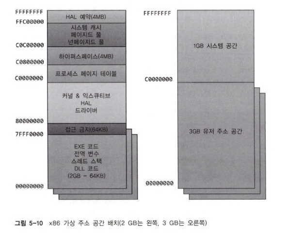
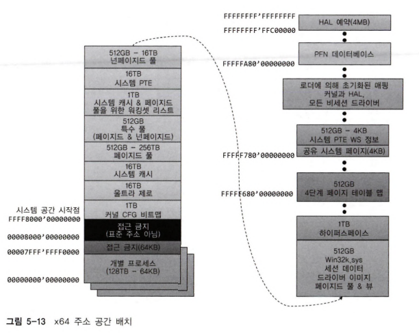
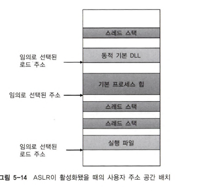
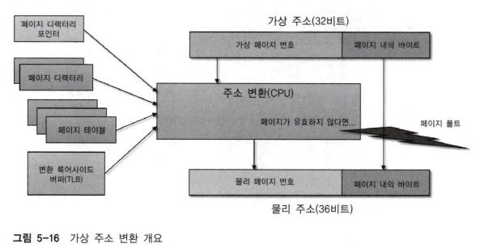
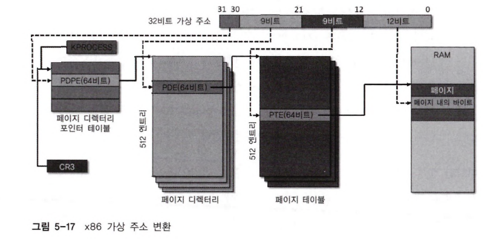

# Windows Internals vol.1 - 05 메모리 관리자
윈도우가 가상 메모리를 어떻게 구현했으며, 물리 메모리에서 가상 메모리를 어떻게 관리하는지 설명한다.

- [Windows Internals vol.1 - 05 메모리 관리자](#windows-internals-vol1---05-메모리-관리자)
- [1. 메모리 관리자](#1-메모리-관리자)
  - [1.1. 메모리 관리자 컴포넌트](#11-메모리-관리자-컴포넌트)
  - [1.2. 큰 페이지와 작은 페이지](#12-큰-페이지와-작은-페이지)
  - [1.3. 내부 동기화](#13-내부-동기화)
- [2. 메모리 관리자가 제공하는 서비스](#2-메모리-관리자가-제공하는-서비스)
  - [2.1. 페이지 상태와 메모리 할당](#21-페이지-상태와-메모리-할당)
  - [2.2. 커밋 양과 커밋 제한](#22-커밋-양과-커밋-제한)
  - [2.3. 메모리 락킹](#23-메모리-락킹)
  - [2.4. 할당 단위](#24-할당-단위)
  - [2.5. 공유 메모리와 맵 파일](#25-공유-메모리와-맵-파일)
    - [2.5.1. 섹션 객체](#251-섹션-객체)
  - [2.6. 메모리 보호](#26-메모리-보호)
  - [2.7. 데이터 실행 방지](#27-데이터-실행-방지)
  - [2.8. 쓰기 시 복사 Copy On Write](#28-쓰기-시-복사-copy-on-write)
  - [2.9. 주소 윈도잉 확장](#29-주소-윈도잉-확장)
- [3. 커널 모드 힙(시스템 메모리 풀)](#3-커널-모드-힙시스템-메모리-풀)
  - [3.1. 풀 크기](#31-풀-크기)
  - [3.2. 풀 사용량 모니터링](#32-풀-사용량-모니터링)
  - [3.3. 룩 어사이드 리스트](#33-룩-어사이드-리스트)
- [4. 힙 관리자](#4-힙-관리자)
  - [4.1. 프로세스 힙](#41-프로세스-힙)
  - [4.2. 힙 유형](#42-힙-유형)
  - [4.3. NT 힙](#43-nt-힙)
  - [4.4. 힙 동기화](#44-힙-동기화)
  - [4.5. 저단편화 힙](#45-저단편화-힙)
  - [4.6. 세그먼트 힙](#46-세그먼트-힙)
  - [4.7. 힙 보안 특징](#47-힙-보안-특징)
- [5. 가상 주소 공간 배치](#5-가상-주소-공간-배치)
  - [5.1. x86 주소 공간 배치](#51-x86-주소-공간-배치)
  - [5.2. x86 시스템 주소 공간 배치](#52-x86-시스템-주소-공간-배치)
  - [5.3. 세션 공간](#53-세션-공간)
  - [5.4. 시스템 페이지 테이블 엔트리](#54-시스템-페이지-테이블-엔트리)
  - [5.5. ARM 주소 공간 배치](#55-arm-주소-공간-배치)
  - [5.6. 64비트 주소 공간 배치](#56-64비트-주소-공간-배치)
  - [5.7. x64 가상 주소 제약](#57-x64-가상-주소-제약)
  - [5.8. 동적 시스템의 가상 주소 관리](#58-동적-시스템의-가상-주소-관리)
  - [5.9. 시스템 가상 주소 공간 할당량](#59-시스템-가상-주소-공간-할당량)
  - [5.10. 사용자 주소 공간 배치](#510-사용자-주소-공간-배치)
  - [5.11. 이미지 랜덤화](#511-이미지-랜덤화)
  - [5.12. 스택 랜덤화](#512-스택-랜덤화)
  - [5.13. 힙 랜덤화](#513-힙-랜덤화)
  - [5.14. 커널 주소 공간에서의 ASLR](#514-커널-주소-공간에서의-aslr)
- [6. 주소 변환](#6-주소-변환)
  - [6.1. x86 가상 주소 변환](#61-x86-가상-주소-변환)
    - [6.1.1. 페이지 테이블과 페이지 테이블 엔트리](#611-페이지-테이블과-페이지-테이블-엔트리)

---
<br><br><br>

# 1. 메모리 관리자

메모리 관리자는 두 가지 중요한 임무를 가진다.

* i) 해당 프로세스의 컨텍스트에서 실행하는 스레드가 가상 주소 공간을 R/W할 때 정확한 물리 메모리를 참조할 수 있게 프로세스의 가상 주소 공간을 물리 메모리로 변환하거나 매핑하는 작업을 수행해야 한다.

* ii) 메모리가 과도하게 커밋돼 메모리의 일부 내용을 디스크로 페이징 시키거나 페이징된 내용이 필요할 때 물리 메모리로 가져오는 작업을 수행해야 한다.

가상 메모리 관리뿐만 아니라 다양한 핵심적인 서비스도 제공한다. MMF나 CopyOnWrite를 사용하는 어플의 지원 등이 있다.

제어판에서 가상 메모리와 페이징 파일이 동일한 것 처럼 암시하지만, 페이징 파일은 가상메모리의 한 부분일 뿐이다. 페이징 파일을 사용하지 않게 하더라도 시스템은 여전히 가상 메모리를 사용한다.


## 1.1. 메모리 관리자 컴포넌트

메모리 관리자는 윈도우 익스큐티브의 일부분으로 Ntoskrnl.exe.파일에 존재한다. 이는 익스큐티브에서 가장 큰 컴포넌트이며, 메모리 관리자의 중요성과 복잡성을 암시한다. 메모리 관리자는 HAL에는 존재하지 않는다.
메모리 관리자는 다음과 같은 컴포넌트로 구성된다.

* i) 가상 메모리에 대한 할당과 해제, 관리를 위한 익스큐티브 서비스 집합으로 이들 대부분은 커널 모드 디바이스 드라이버 인터페이스나 윈도우 API를 통해 외부에 노출돼 있다.

* ii) 하드웨어 탐지 메모리 관리 예외를 처리하고 프로세스를 위해 가상 페이지를 물리 메모리에 상주시키기 위한 유효하지 않은 메모리 변환(Translation-not-valid) 과 액세스 폴트 트랩 핸들러

* iii) 시스템 프로세스 내에서 6개의 서로 다른 커널 모드 스레드로 동작하는 6개의 중요 최상위 루틴
  -	밸런스 셋 관리자(우선순위 17):1초에 한 번씩 또는 사용 가능 메모리 양이 특정 임계치 
이하로 떨어질 때 마다 내부 루틴인 워킹셋 관리자를 호출한다. 워킹셋 관리자는 워킹셋 정돈이나 에이징, 변경된 페이지에 대한 쓰기 작업 등의 전반적인 메모리 관리 정책들을 처리한다.

  -	프로세스/스택 스와퍼(우선순위 23): 프로세스와 커널 스레드 스택에 대한 스와핑을 
수행한다. 밸런스 셋 관리자와 커널 내의 스레드 스케줄링 코드는 스와핑이 필요할 때마다 
이 스레드를 깨운다.

  -	변경된 페이지 기록자(우선순위 18): 변경된 리스트에 존재하는 더티 페이지를 적절한
페이징 파일에 적는다. 이 스레드는 변경된 페이지 리스트의 개수가 줄어야 할 때마다
깨어난다.

  -	맵 페이지 기록자(우선순위 18): 더티 페이지를 디스크나 원격 저장소에 매핑된 파일에 
적는다. 이 스레드는 변경된 페이지 리스트의 개수가 줄어야 할 때나 매핑된 파일의
페이지가 변경된 페이지 리스트에 5분 이상 있다면 깨어난다. 이 두 번째 변경된 페이지
기록자 스레드는 프리 페이지에 대한 요청으로 페이지 폴트가 발생할 수 있기 때문에
반드시 필요하다. 만약 페이지 기록자 스레드가 오직 하나뿐이고 프리 페이지가 없다면
시스템은 프리 페이지를 기다리다 데드락에 빠질 수 있다.

  -	세그먼트 역참조 스레드(우선순위 19): 캐시를 축소시키거나 페이지 파일을 확장시키고
	축소시키는 작업을 수행한다. 예를 들어 페이지드 풀의 확장을 위한 가상 주소 공간이
	없을 경우 이 스레드는 페이지 캐시를 잘라내 페이지드 풀에서 재사용할 수 있게 된다.

  -	제로 페이지 스레드(우선순위 0): 프리 리스트의 페이지를 0으로 초기화해 미래의 제로
	페이지 폴트를 처리하는 데 제로 페이지 캐시가 사용될 수 있게 한다.

정리하면 메모리 관리자는 다음 작업들을 수행하는 스레드를 적절하게 깨운다는 뜻이다.
- 1 1초에 한번이나 사용 가능량이 떨어지면 전반적인 메모리 관리 처리자를 호출하는 스레드
- 2 유저와 커널 스택을 스와핑하는 스레드
- 3 더티 페이지를 페이징 파일로 밀어내는 스레드와 그와 비슷한 역할을 수행하는 또 다른 스레드
- 4 페이징 파일을 키우고 줄이는 스레드
- 5 프리 페이지를 0으로 미는 스레드

## 1.2. 큰 페이지와 작은 페이지

메모리 관리는 페이지로 불리는 단위로 이루어진다. 하드웨어 메모리 관리 장치가 페이지 단위로 가상 메모리를 물리 메모리로 변환하기 때문이다. 따라서 하드웨어 수준에서 보호할 수 있는 최소 단위는 페이지다.

큰 페이지라면 페이지에 포함된 데이터를 참조할 때 메모리 변환이 빠르다. 동일한 페이지라면 TLB가 히트치기 때문이다. 만약 페이지가 많다면 더 많은 TLB엔트리가 필요하겠다. TLB는 아주 작은 캐시이기 때문에 큰 페이지는 이 리소스를 더 잘 사용한다.


아직 때가 안왔으니 생략


## 1.3. 내부 동기화

메모리 관리자는 완전한 재진입을 허용하고 멀티프로세서 시스템에서 동시 실행을 지원한다. 즉, 이것은 두 개 이상의 스레드가 서로 다른 스레드의 데이터에 영향을 주지 않으면서 자원을 획득할 수 있게 한다. 이를 위해 스핀락과 Interlocked같은 상이한 다수의 동기화 메커니즘을 사용해 내부 데이터 구조체에 대한 접근을 관리한다.

메모리 관리자가 동기화를 수행해야 하는 시스템 전역적인 자원은 다음과 같다.

-	동적으로 할당되는 시스템 가상 주소 공간의 부분
-	시스템 워킹셋
-	커널 메모리 풀
-	로드된 드라이버 리스트
-	페이징 파일 리스트
-	물리 메모리 리스트
-	이미지 베이스 랜덤화 주소 공간 배치 랜덤화 구조체
-	페이지 프레임 번호(PFN) 데이터베이스 내의 각 엔트리

프로세스마다 동기화가 필요한 메모리 관리 데이터 구조체는 다음과 같다.

-	워킹셋 락: 워킹셋 리스트에 변경이 가해지는 동안 유지되는 락
-	주소 공간 락: 주소 공간을 변경할 때마다 유지되는 락

이들은 푸시락에 의해 구현된다고 한다.

# 2. 메모리 관리자가 제공하는 서비스

* 가상 메모리에 대한 할당과 해제 `메모리API`
* 프로세스 간의 메모리 공유 `DLL? 혹은 커널 오브젝트로 통신?`
* 파일을 메모리로 매핑 `MMF`
* 가상 페이지를 디스크로 플러시 `페이지 아웃`
* 가상 페이지 범위에 관한 정보를 추출 `VAD트리`
* 가상 페이지에 대한 보호 속성 변경 `VirtualProtect()`
* 가상 페이지를 메모리에 락시키는 등의 시스템 서비스 `락시킨다는게 뭔지 이해안됨. VirtualLock()?`

메모리 관리자는 가상 메모리를 조작하려는 대상 프로세스에 대한 핸들을 지정할 수 있고, 이로 인해 자신의 메모리뿐만 아니라 다른 프로세스의 메모리까지 적절한 권한을 갖고 조작이 가능하다.(예를 들어 부모 프로세스가 자식 프로세스의 핸들을 서비스의 인자로 넘겨 자식 메모리를 할당, 해제, 읽기, 쓰기 할 수 있다.) 이는 다른 프로세스의 메모리를 조작해야하는 디버거 구현의 핵심 요소이다.

대부분 이런 서비스는 윈도우API를 통해 노출돼 있다. API는 어플리케이션에서 메모리 관리 용도로 다음과 같은 네 그룹의 함수를 가진다.

-	가상API: 일반적인 할당과 해제를 위한 가장 저수준의 API로서 항상 페이지 단위로 
동작한다. VirtualAlloc, VirtualLock 등이 이해 해당된다.

-	힙API: 작은 할당을 위한 함수를 제공한다. 내부적으로 가상 API를 사용하지만 상단에
	관리 계층을 추가한다. HeapAlloc 등이 존재한다.

-	지역/전역APU: 16비트 레거시. 이제는 힙을 쓴다.

-	MMF: 매핑 파일을 협력 프로세스 간에 공유 메모리로 사용하게 한다.
	CreateFileMapping, MapViewOfFile 등이 있다.

```
// 유저 모드에서의 메모리API 그룹

지역/전역 API        C/C++ 런타임 (컴파일러 의존적. 강제적 사항은 X)
      └─────────┬─────────┘
			  힙 API
			    │
	     	 가상 API             파일 매핑 API
User            └──────────┬───────────┘
---------------------------┼----------------------
Kernel                     │
                      메모리 관리자 
```

외에도 디바이스 드라이버뿐만 아니라 익스큐티브 내의 다른 커널 컴포넌트에게도 다양한 서비스를 제공하는데, 물리 메모리의 할당과 해제, 직접 메모리 접근(DMA) 전송을 위한 물리 메모리 내에 페이지 락킹이 여기에 해당한다. 이런 함수는 Mm접두어로 시작한다. 엄격하게는 메모리 관리자의 일부분은 아니지만 일부 익스큐티브는 시스템 힙에 대한 할당과 해제(페이지드 풀과 NP풀), 룩 어사이드 리스트 조작 같은 기능을 수행하는 Ex로 시작하는 함수들을 제공한다.

## 2.1. 페이지 상태와 메모리 할당

한 프로세스의 가상 주소 공간 내의 페이지는 **해제**, **예약**, **커밋**, **공유가능** 중 하나이다.
커밋되고 공유 가능한 페이지는 접근될 때 최종적으로 물리 메모리 내의 유효한 페이지로 변환되는 페이지이다.
커밋된 페이지는 전용(private) 페이지라고도 불린다. 커밋된 페이지는 다른 프로세스와 공유될 수 없고 반면 공유 가능 페이지는 공유가 가능하다.

**private페이지**는 VirtualAlloc 등의 윈도우 함수를 통해 할당된다. 이 함수 시리즈는 메모리 관리자 내부의 NtAllocateVirtualMemory함수가 있는 익스큐티브로 최종적으로 이어진다. 이들 함수는 메모리의 커밋과 예약을 할 수 있다.
어플리케이션은 연속된 주소의 범위를 예약(확보)할 수 있고, 필요에 따라 이 공간에서 커밋을 할 수 있다. 또는 크기 요구 사항을 안다면 한 번의 함수 호출로 예약과 커밋을 동시에 할 수 있다.
해제됐거나 예약된 메모리에 접근을 시도하면 어떠한 저장소에도 매핑돼 있지 않기 때문에 예외를 일으킨다.

커밋된(전용) 페이지가 아직 한 번도 접근된 적이 없다면 최초 접근 시 0으로 초기화 된(또는 demand zero) 상태로 생성된다. 커밋된 전용 페이지는 물리 메모리에 대한 요구가 있을 경우 OS에 의해 페이징 파일에 자동으로 저장될 수 있다.
>> '전용' 이라는 것은 이 페이지는 일반적으로 다른 프로세스에 의해 접근될 수 없다는 사실을 나타낸다.

>> `ReadProcessMemory`나 `WriteProcessMemory`같은 일부 함수는 프로세스 간의 메모리 접근을 허용하는 것처럼 보인다. 하지만 이들 함수는 대상 프로세스의 컨텍스트에서 동작하는 커널 모드 코드에 의해 구현된다. (이것을 프로세스에 attaching한다고 말한다.) 또한 권한이 필요하다. (권한에 대한건 필요할때 참조)

**공유(Sharable) 페이지**는 일반적으로 섹션 뷰에 매핑된다. 모든 공유 페이지는 잠재적으로 다른 프로세스와 공유될 수 있다. 섹션은 윈도우API에서 **파일 매핑 객체**로 노출된다.

페이지는 **변경된 페이지 쓰기 modified page writing**라는 메커니즘에 의해 디스크에 기록된다. 이것은 페이지가 프로세스의 워킹셋에서 변경된 페이지 리스트라 불리는 시스템 전역적인 리스트로 이동하면서 일어난다. `FlushViewOfFile`을 명시적으로 호출하거나 메모리 요청 발생 시 **맵 페이지 기록자 Mapped page writer**에 의해 디스크의 매핑된 원본 파일에 써진다.

VirtualFree를 이용해 전용 페이지를 디커밋 하거나 주소 공간을 디커밋 할 수 있다. 디커밋과 해제의 차이는 예약과 커밋의 차이와 동일하며, 디커밋된 메모리는 아직 예약된 상태이지만 해제된 메모리는 커밋도 예약도 아닌 프리 상태가 된다.

가상 메모리를 예약하고 커밋하는 두 단계를 사용하면 가상 메모리의 연속성은 보장해주면서 실제 필요한 시점까지 페이지의 커밋을 지연시킴으로써 **커밋 양commit charge**이 시스템에 추가되는 것을 연기한다. 메모리 예약은 아주 작은 양의 실제 메모리를 소비하기 때문에 상대적으로 저렴하다. 이때 변경되는 것은 프로세스의 주소 공간 상태를 나타내는 **페이지 테이블**과 **가상 주소 디스크립터 VAD Virtual Address descriptor**라는 내부 데이터 구조체 뿐이다.

전체 공간을 예약하고 필요할 때마다 커밋하는 방법을 사용하는 가장 대표적인 예는 유저 스레드 스택이다. 기본적으로 스택의 첫 번째 페이지는 커밋되고(실제론 x86에서 두개 x64에서 세개로 확인함.) 다음 페이지는 가드 페이지로 설정돼 트랩을 발생시키고 확장하는 형태로 동작한다.

## 2.2. 커밋 양과 커밋 제한

메모리 관리자는 전역적으로 커밋된 전용 메모리 사용을 추적하는데 이를 **커밋 양**이라고 한다.
작업관리자에서 메모리 부분을 보면 커밋됨이라는 항목에 두 숫자를 확인할 수 있다. 
* 시스템 내의 커밋된 가상 메모리 전체
* 현재 모든 페이징 파일의 전체 크기와 OS에 의해 사용 가능한 RAM양을 합친 것

지금은 항목이 좀 다른듯. 나는 커밋 양을 주로 봄.

## 2.3. 메모리 락킹

일반적으론 메모리 관리자가 물리 메모리에 뭘 남길지 결정하는게 효율적이다. 그러나 어플리케이션이나 디바이스 드라이버가 물리 메모리의 페이지를 직접 **락킹Locking**해야 하는 특수한 경우가 있는데, 다음 두 가지 방법으로 할 수 있다.

* 어플리케이션은 `VirtualLock()`을 사용한다. 명시적으로 해제하거나 프로세스가 종료될 때까지 메모리에 존재한다. 하나의 프로세스에서 락킹할 수 있는 페이지 수는 자신의 최소 워킹셋 크기에서 8 페이지를 뺀 값을 초과할 수 없다. 더 많은 페이지를 락킹하기 위해선 `SetProcessWorkingSetSizeEx()` 함수를 이용해 워킹셋 크기의 최솟값을 증가시켜야 한다.
* 디바이스 드라이버가 Mm접두어를 가진 커널 모드 함수를 호출한다. 이 메커니즘은 페이지를 명시적으로 락킹을 해제할 때까지 메모리에 존재하게 된다.

## 2.4. 할당 단위

윈도우는 예약된 프로세스 주소 영역의 시작 위치를 `GetSystemInfo`를 통해 구할 수 있는 **시스템 할당 단위Granularity**값의 배수가 되는 곳에서부터 시작하게끔 정렬한다. 이 값은 **64KB**로 메모리 관리자가 프로세스의 다양한 동작을 지원하기 위한 메타데이터(예를 들어 VAD나 비트맵 등)를 효과적으로 할당하기 위해 사용하는 단위이다.

메모리 공간이 예약될 때 윈도우는 영역의 시작과 크기가 어떠한 경우라도 시스템 페이지 크기의 배수가 되게 보장한다. 예를 들어 x86 시스템은 4KB페이지를 사용하기 때문에 18KB 크기의 메모리 영역을 예약하면 실제 예약되는 크기는 20KB이다. 18KB영역에 대한 시작 주소를 3KB로 지정한다면 실제 예약되는 크기는 24KB가 된다. 이때 할당된 VAD는 64KB 단위로 정렬되므로 예약하고 남은 영역은 접근할 수 없게 된다.

## 2.5. 공유 메모리와 맵 파일
대부분 OS들과 같이 윈도우도 프로세스간 메모리 공유 메커니즘을 제공한다. 예를 들어 두 프로세스에서 동일한 DLL을 사용한다면 해당 DLL의 코드 페이지를 물리 메모리로 한 번만 로딩시키고 해당 DLL을 매핑한 모든 프로세스가 그 페이지를 공유하는 것이 이치에 맞다.

```
///////////// 프로세스 간 메모리 공유 ////////////

|      프로세스 A       |        **RAM**         |        프로세스 B         |

[Kernel32.DLL]  ─┐                                   ┌──  [Kernel32.DLL]
                 └──────   [Kernel32.DLL Code]  ─────┘  
                           [                 ]    
                           [                 ]
[EXE Code] ──────────────  [Process A Code   ]
                           [Process B Code   ] ────────────── [EXE Code]
                           [                 ]
// 물리 메모리에 매핑돼 있는 DLL을 공유하는 다른 이미지의 두 프로세스.
// 두 프로세스가 다른 이미지를 실행하므로 이미지(EXE)코드 자체는 공유되지 않음.
// 이미지는 NotePad.exe를 실행하는 둘 이상의 프로세스처럼 동일한 이미지를 실행하는 프로세스 간에 공유됨.
```

각 프로세스는 개별 데이터를 저장하기 위해 자신의 전용 메모리 영역을 여전히 유지하겠지만 DLL코드나 변경되지 않는 데이터 페이지는 손상 없이 공유될 수 있다.

실행 파일 (EXE와 DLL, 세이버SCR 같은 여타 종류의 파일)의 코드 페이지는 실행 전용 속성으로만 매핑되고 쓰기 가능한 페이지는 쓰기 시 복사 속성 (COW)으로 매핑되기 때문에 이런 공유는 자동으로 이뤄진다.
<br><br>

### 2.5.1. 섹션 객체

공유 메모리의 구현을 위해 사용되는 메모리 관리자 내부의 프리미티브는 **섹션 객체Section Object**라고 불리며, 이는 윈도우 API에서는 **파일 매핑 객체 File mapping object**로 공개된다. 

섹션 객체는 가상 주소를 매핑하기 위해 사용되는데, 가상 주소가 메인 메모리 · 페이징 파일 · 어플리케이션이 메모리에 존재하는 것처럼 존재하고 싶은 파일에 있을 때도 상관없다. 섹션은 하나의 프로세스나 여러 프로세스에 의해 열릴 수 있다. **즉, 섹션 객체는 공유 메모리와 완전히 동일할 필요는 없다.**

섹션 객체는 디스크의 오픈된 파일(맵 파일로 불린다.)이나 커밋된 메모리와 연결될 수 있다. 커밋된 메모리에 매핑된 섹션은 **페이지-파일-백업 섹션 Page-file-backed-sections**으로 불린다. 이는 물리 메모리 요청이 발생하면 해당 페이지가 페이징 파일로 쓰이기 때문이다. 유저 모드에서 보이는 빈 페이지의 경우처럼 중요한 데이터의 노출을 막기 위해 커밋된 공유 페이지는 최초 접근 시 0으로 초기화된다.

윈도우 애플리케이션은 맵 파일 기법을 이용해 파일을 자신의 주소 공간에 존재하는 것처럼 매핑한 후 편하게 파일에 대한 I/O작업을 수행할 수 있다. 이는 유저 어플리케이션에서만 사용되는 것은 아니다. 이미지 로더는 실행 이미지나 DLL 디바이스 드라이버를 메모리로 매핑하기 위해 섹션 객체를 사용하며, 캐시 관리자는 캐시된 파일 내의 데이터를 접근하기 위해 섹션 객체를 사용한다.

## 2.6. 메모리 보호

윈도우는 메모리 보호 기능을 제공해 사용자 프로세스가 우연이나 고의적으로 다른 프로세스나 운영체제의 메모리 주소 공간을 손상시키지 못하게 한다. 다음과 같은 4가지 방법으로 메모리 보호 기능을 제공한다.
* **커널 모드 시스템 컴포넌트에 의해 사용되는 모든 시스템 데이터나 메모리 풀은 커널 모드에서만 접근이 가능하다.** 유저 모드 스레드에서 접근하게 되면 하드웨어는 폴트를 일으키고 메모리 관리자는 접근을 시도한 스레드에게 메모리 접근 위반 오류를 보고한다.
* 각 프로세스는 다른 프로세스에 포함된 스레드에 의한 접근으로부터 보호되는 자신만의 분리된 전용 주소 공간을 갖는다. 공유 영역도 자신의 가상 주소 공간의 일부분인 주소를 이용해 접근하기 때문에 사실 공유 메모리도 예외는 아니다. `유일한 예외는 다른 프로세스에서 해당 프로세스 객체에 대해 가상 메모리 쓰기나 읽기 권한을 갖고 ReadProcessMemory/WriteProcessMemory 함수를 이용하는 것이다.` 스레드가 해당 주소에 접근할 때마다 가상 메모리 하드웨어는 메모리 관리자와 연계해 가상 주소를 물리 주소로 변환한다. **윈도우는 가상 주소가 물리 주소로 변환되는 과정을 제어함으로써 함 프로세스에서 동작하는 스레드가 다른 프로세스에 포함된 페이지에 부적절하게 접근하지 못하게 한다.**
* 윈도우에서 지원하는 모든 프로세서는 일종의 하드웨어 제어 메모리 보호를 지원한다.(자세한 보호 옵션은 프로세서 별로 다르다.) 예를 들어 프로세스의 주소 공간 내의 코드 페이지는 읽기 전용으로 설정돼 있어 유저 스레드에 의한 변경으로부터 보호된다. 관련함수`VirtualProtect, VirtualQuery`
* 공유 메모리 섹션 객체는 프로세스가 섹션 객체를 열려고 시도할 때 적절한 접근 권한을 갖고 있는지 검사하는 표준화된 윈도우 접근 제어 목록 ACL을 갖고 있어 공유 메모리에 대한 접근을 제한할 수 있다. 또한 스레드가 맵 파일을 포함하는 섹션을 생성하려고 할 때에도 접근 제어가 적용된다. 섹션을 생성하기 위해 스레드는 대상이 되는 파일 객체에 대해 적어도 읽기 권한을 가져야 한다.

스레드가 섹션에 대한 핸들을 성공적으로 열게 되더라도 메모리 관리자와 하드웨어 기반의 페이지 보호 기능에 의해 제한을 받는다. 스레드가 해당 섹션 객체에 대한 ACL의 접근 권한을 위반하지 않는다면 스레드는 섹션 내의 가상 페이지에 대한 페이지 수준의 보호 속성을 변경할 수 있다. 예를 들어 메모리 관리자는 스레드가 읽기 전용 섹션의 페이지를 COW로 변경할 수 있게 하지만, 읽기/쓰기로의 변환은 허용하지 않는다. COW는 데이터를 공유하는 다른 프로세스에 전혀 영향을 주지 않기 때문이다.

## 2.7. 데이터 실행 방지
**실행 방지**로 표시된 페이지에서 명령어가 실행될 때 접근 폴트를 발생시킨다. 이는 시스템의 버그 또는 취약점을 이용해 익스플로잇Exploit을 발생시킨 후 스택 등의 데이터 페이지에 코드를 실행하는 악성코드를 차단할 수 있다. 

프로세스가 실행할 필요가 있는 메모리를 할당한다면 PAGE_EXECUTE시리즈 플래그를 페이지 단위의 메모리 할당 함수에 반드시 명시적으로 지정해야 한다.

보안은 아직 모르겠음. 생략.

## 2.8. 쓰기 시 복사 Copy On Write
쓰기 시 복사 페이지 보호는 물리 메모리를 절약하기 위해 사용하는 최적화 방법이다. 

읽기/쓰기 속성이 있는 페이지를 포함한 섹션 객체에 대해 프로세스가 쓰기 시 복사 뷰로 매핑하면 뷰가 매핑되는 순간 프로세스 전용 복사본을 만드는 대신 메모리 관리자는 **페이지에 쓰기 행위가 일어나는 순간까지 페이지 복사를 지연**시킨다.

COW페이지에 쓰기 시도를 하면 액세스 예외 에러를 보고하는 대신 다음과 같은 작업을 수행한다.
* ① 물리 메모리에 읽기/쓰기 속성을 가진 새로운 페이지를 할당한다.
* ② 원본 페이지에 있던 데이터를 새로운 페이지에 복사한다.
* ③ 해당 프로세스에서 사용하는 페이지 매핑 정보를 새로운 위치를 가리키도록 갱신한다.
* ④ 발생된 예외를 취소시킨 후 예외가 발생했던 코드를 다시 수행하게 한다.

새롭게 복사된 페이지는 쓰기 작업을 수행했던 프로세스의 전용 메모리가 되고, COW페이지를 공유하는 다른 프로세스는 여전히 새롭게 복사된 이 페이지를 볼 수 없다. **즉, 이 공유 페이지에 쓰면 자신만의 전용 메모리 복사본을 갖게된다.**

이런 COW의 대표적인 예는 디버거에서 제공하는 BreakPoint의 구현이다. 예를 들어 코드 페이지의 속성은 기본적으로 실행만 가능한 상태다. 프로그래머가 브레이크포인트를 설정하면 디버거는 코드에 DebugBreak()를 추가해야 한다. 먼저 해당 페이지 보호 속성을 PAGE_EXECUTE_READWRITE로 변경하고 명령 스트림을 변경한다. 해당 코드페이지는 매핑된 섹션의 일부분이므로 메모리 관리자는 해당 프로세스에 브레이크포인트가 설정된 전용 메모리를 새롭게 할당하고, 다른 프로세스들은 변경되지 않은 코드 페이지를 사용하게 해준다.

쓰기 시 복사는 메모리 관리자가 가능한 한 많이 사용하는 **지연 평가 Lazy Evaluation**기법 중 하나다. 지연 평가 알고리즘은 값비싼 행위의 요청이 일어났을 때 실제 동작이 확실히 필요할 때까지 해당 요청에 대한 처리를 최대한 미룸으로써 행위가 일어나지 않을 경우 불필요한 행위를 하지 않게 한다.

성능 모니터의 메모리 범주에서 Copies/sec 성능 카운터 변수에서 COW예외에 대한 빈도수를 확인할 수 있다.

## 2.9. 주소 윈도잉 확장
32비트 윈도우에서는 최대 64GB까지 물리 메모리를 지원하지만 프로세스는 기본적으로 2GB만의 가상 주소 공간을 갖는다. 이 이상의 데이터를 필요로 하는 어플리케이션은 파일 매핑을 통해 대용량 파일의 여러 부분을 자신의 주소 공간으로 다시 매핑해 사용할 수 있다. 하지만 상당한 페이징 작업이 이런 재매핑에 관여된다.

가상 주소 공간보다 큰 파일을 매핑해야하는 상황에서 윈도우는 높은 성능과 정교한 제어를 위해 **주소 윈도잉 확장 AWE AddressWindowingExtension**이라는 함수 계열을 지원한다. 이들 함수는 프로세스의 가상 주소 공간으로 표현할 수 있는 것보다 더 많은 물리 메모리를 할당할 수 있게 해준다.

당장 안쓰니 생략.

<br><br>

# 3. 커널 모드 힙(시스템 메모리 풀)

시스템 초기화 시점에 메모리 관리자는 대부분의 커널 모드 컴포넌트가 시스템 메모리 할당을 위해 사용하는 동적인 크기를 갖는 두 개의 메모리 풀이나 힙을 생성한다.
* **넌페이지드 풀(Nonpaged Pool)**  항상 물리 메모리 내에 있게 보장되는 시스템 가상 주소 영역으로 구성된다. 언제라도 페이지 폴트 없이 접근 가능하다. 이는 어떤 IRQL에서도 접근이 가능함을 의미한다. DPC/디스패치 레벨이나 더 상위의 IRQL에서는 페이지 폴트를 처리할 수 없기 때문에 그 이상의 레벨에서 접근되는 데이터나 수행되는 코드는 반드시 페이징되지 않는 메모리에 있어야 한다.
* **페이지드 풀(Paged Pool)** 페이지 아웃되거나 페이지 인이 될 수 있는 시스템 가상 주소 영역이다. DPC/디스패치 레벨이나 더 상위의 IRQL에서 해당 메모리에 접근할 필요가 없는 디바이스 드라이버가 이것을 사용할 수 있다. 어떤 프로세스 컨텍스트에서도 접근이 가능하다.

두 메모리 풀 모두 시스템 영역의 주소 공간에 위치하며, 모든 프로세스의 가상 주소에 매핑돼 있다. 익스큐티브는 이들 풀로부터 할당학나 해제할 수 있는 서비스를 제공한다.

## 3.1. 풀 크기
NP풀은 시스템의 물리 메모리 크기에 따라 다른 초깃값을 갖고 시작되며, 필요에 따라 늘어날 수 있다. 초기 크기는 시스템 물리 메모리의 약 3%이며, 이것이 40MB보다 작다면 40MB가 초깃값이 되고, 40MB가 시스템 물리 메모리의 10%보다 크다면 10%가 최솟값이 된다.

생략

## 3.2. 풀 사용량 모니터링
생략

## 3.3. 룩 어사이드 리스트
윈도우는 **룩 어사이드 리스트 look-aside list**라는 빠른 메모리 할당 메커니즘을 제공한다. 풀과 룩 어사이드 리스트의 기본적인 차이점은 풀이 다양한 크기를 할당할 수 있는 반면 룩 어사이드 리스트는 고정 크기만 할당할 수 있다는 점이다. 풀이 더 유연하게 사용될 수 있지만 룩 어사이드 리스트는 스핀락을 사용하지 않기 때문에 더 빠르다.

생략.
<br><br>

# 4. 힙 관리자

최소 할당 단위인 64KB보다 작은 영역을 할당하기 위해 대부분의 어플리케이션은 VirtualAlloc같은 페이지 단위의 함수를 사용한다. 하지만 이런 큰 영역을 할당하는 것은 메모리 사용성이나 성능 면에서 최상의 방법은 아니다. 이를 극복하기 위해 윈도우는 미리 예약된 큰 영역의 메모리 내에서 페이지 단위의 할당 관련 함수를 이용해 메모리 할당을 지원하는 **힙 관리자 Heap manager** 컴포넌트를 제공한다. 힙 관리자 내에서의 **할당 단위**는 다음과 같다.

| 32비트 시스템 | 8바이트 |
|---|---|
 64비트 시스템 | 16바이트 |

**32비트 시스템에서는 8바이트**이고, **64비트 시스템에서는 16바이트**로 상대적으로 작다. 

힙 관리자는 이처럼 작은 영역의 메모리 사용 시 메모리 사용성과 성능을 최적화하기 위해 만들어졌다.

힙 관리자는 Ntdll.dll과 Ntosknl.exe 두 곳에 위치한다. 서브시스템 API(윈도우 힙 API 같은)는 Ntdll.dll 내의 함수를 호출하고 여러 익스큐티브 컴포넌트와 디바이스 드라이버는 Ntoskrnl.exe 내의 함수를 호출한다. 

Rtl로 시작하는 네이티브 인터페이스 함수는 내부 윈도우 컴포넌트나 커널 모드 디바이스 드라이버에서만 사용 가능하다.

Heap으로 시작하는 힙과 관련된 문서화된 윈도우 API는 Ntdll.dll 내의 네이티브 함수로 포워딩돼있다. 가장 대표적인 윈도우 힙 함수는 다음과 같다.
|HeapCreate나 HeapDestroy| 힙을 생성하거나 삭제한다. 초기 예약되거나 커밋되는 메모리 크기는 생성 시 설정한다.|
|---|---|
| HeapAlloc | 힙 블록을 할당한다. Ntdll.dll 내의 RtlAllocateHeap으로 전달된다.|
| HeapFree |HeapAlloc으로 할당된 힙 블록을 해제한다.|
| HeapReAlloc | 기존 할당된 영역의 크기를 변경하고 기존 블록의 크기를 늘리거나 줄인다. Ntdll 내의 RtlReAllocateHeap으로 전달된다.|
| HeapLock이나 HeapUnlock|힙 조작에 관한 상호 배제를 제어한다.|
| HeapWalk | 힙 내의 엔트리와 영역을 열거한다.|

## 4.1. 프로세스 힙

각 프로세스는 기본 힙을 가지는데, 프로세스 시작 시 생성되며 종료될 때까지 사라지지 않는다. 기본 크기는 1MB이다. 이 크기는 단순히 초기 예약되는 크기로, 필요에 따라 자동으로 늘어난다.

기본 힙은 프로그램 내에서 명시적으로 사용될 수도 있고 윈ㄷ우 내부 함수에 의해 암묵적으로 사용될 수도 있다.

힙은 메모리 관리자로부터 VirtualAlloc을 통해 예약된 큰 메모리 영역 내의 할당 또는 프로세스의 주소 공간에 매핑된 메모리 맵 파일 객체로부터의 할당을 관리할 수 있다. 후자는 거의 사용되지 않지만(윈도우API에 의해 노출돼 있지 않음) 두 프로세스 간이나 커널 모드와 유저 모드 컴포넌트 간에 블록의 내용을 공유할 필요가 있을 때 용이하다. 

## 4.2. 힙 유형
생략

## 4.3. NT 힙
유저 모드 내의 NT 힙은 프론트엔드와 힙 백엔드(힙 코어)의 두 계층으로 구성돼 있다.

백엔드 계층은 기본 기능을 처리하고 세그먼트 내부의 블록 관리와 세그먼트의 관리, 힙 확장 정책, 메모리 커밋과 디커밋, 큰 블록 관리를 포함한다.

```
// 유저 모드에서의 NT 힙 계층

              ┌─────────────┐
              │ 어플리케이션 
              └─────┬───────┘
                    ↓
              ┌─────────────┐              
              │   힙 API            ← Kernel32.dll       
              └─────┬───────┘              
                    ↓
            ┌───────────────────┐
            │ 힙 프론트엔드 계층 
            ├───────────────────┤    ← NTDLL.dll
            │     힙 백엔드     
            └────────┬──────────┘
User Mode            │
---------------------│--------------------------       
Kernel Mode          ↓
              ┌──────────────┐
              │ 메모리 관리자 
              └──────────────┘
메모리 관리자
```

유저 모드 힙에서만 핵심 기능 위에 프론트엔드 힙 계층이 존재할 수 있다. 윈도우에서 제공되는 유일한 프론트엔드 기능은 저단편화 힙이다.

## 4.4. 힙 동기화

힙 관리자는 기본적으로 멀티스레드의 동시 접근을 지원한다. 하지만 프로세스가 하나으 ㅣ스레드로만 동작하거나 외부 동기화 메커니즘을 사용한다면 힙 생성 시나 할당 시 HEAP_NO_SERIALIZE 플래그를 명시에 힙 관리자의 동기화 오버헤드를 방지할 수 있다. 힙 동기화가 활성화된다면 모든 힙 내부 구조체를 보호하는 락이 힙마다 하나씩 존재하게 된다.

>> 근데 나는 동기화 피하는김에 메모리풀을 따로 만들어 썼음.

## 4.5. 저단편화 힙

보통 어플리케이션은 1MB 이하의 상대적으로 작은 힙 메모리를 많이 사용한다. 
이 때 힙 관리자의 최선 맞춤 Best-fit 정책은 프로세스가 작은 메모리 사용량을 유지하게 도움을 준다. 그러나 큰 프로세스나 멀티프로세서 시스템에 적용할 수 없다. 
이런 경우 힙 단편화로 인해 사용 가능한 힙 공간은 줄어들 것이다. 
>> Best-fit: 요청한 메모리를 수용 가능한 가장 크기가 작은 블록을 선택해 할당하는 방식. 메모리 낭비를 최소화하는데 초점이 맞춰짐.

서로 다른 프로세서에서 스케줄링되는 서로 다른 스레드가 동시에 일정한 크기의 메모리만을 사용하는 시나리오에서는 여러 개의 프로세서가 같은 위치의 메모리에 동시에 쓰기 동작을 하려 할 때 해당 캐시 라인에 심각한 경쟁이 발생해 성능이 저하된다.

LFH 버킷이라는 미리 정의된 서로 다른 크기의 범위를 갖는 블록을 관리함으로써 단편화를 해결한다. 프로세스가 힙에서 메모리를 할당하려고 하면 LFH는 요청된 크기를 포함할 수 있는 가장 작은 버킷에 대응하는 버킷을 선택한다. 첫 번째 버킷은 1~8바이트, 두 번째 버킷은 9~16바이트 식으로 8바이트 단위의 크기로 32번째 버킷(249~256바이트)까지 늘어난다. 33번째 버킷(257~272바이트)부터는 16바이트 단위의 크기로 늘어나고 결국 마지막인 128번째 버킷은 15,873~16,384바이트 크기의 할당까지 지원할 수 있다.(이것은 바이너리 버디 binary buddy 시스템으로 알려져 있다.) 할당이 16,384바이트보다 크다면 LFH는 이 요청을 하부의 힙 백엔드로 그냥 전달한다.

>> 큰 메모리를 할당하면 외딴곳에 잡히던게 힙 백엔드에 전달한 동작인줄 알았는데, 16,384 이상이어도 그냥 연속적으로 붙어있었음. 64비트 시스템에서는 16,384보다 더 커야 힙 코어로 바로 전달하거나 외딴 곳에 할당되는게 힙코어 전달과는 관계없는듯 함.

>> windbg에서 보니까 메타 데이터가 16바이트라서 8바이트 할당하면 24바이트 퍼주는듯?

윈도우 힙 관리자는 락에 대한 경쟁이 일어나거나 LFH 기능을 활성화한 상태에서 더 좋은 성능을 보여주는 자주 사용되는 크기의 할당이 발생하는 등의 조건에서 기본적으로 LFH를 활성화할 수 있는 자동화된 튜닝 알고리즘을 구현한다. 큰 크기의 힙에서 대부분 할당은 특정 크기를 갖는 상대적으로 작은 수의 버킷으로 그룹화된다. 동일한 크기의 블록을 효율적으로 관리해 이런 패턴의 사용을 최적화 하는 것이 LFH의 할당 전략이다.


|버킷|할당 단위|범위|
|---|---|---|
|1 - 32|8|1 - 256|
|33 - 48|16|257 - 512|
|49 - 64|32|513 - 1,024|
|65 - 80|64|1,025 - 2,048|
|81 - 96|128|2,049 - 4,096|
|97 - 112|256|4,097 - 8,194|
|113 - 128|512|8,195 - 16,384|

x64에서는 16바이트 단위로 커짐.
16바이트 -> 32바이트 -> 48바이트 -> ... -> 16KB.
16KB를 넘으면 일반 힙으로 넘어감.

## 4.6. 세그먼트 힙
기본 힙이 아니라서 아직은 안봄. UWP에선 기본 힙이라고 함.

생략

## 4.7. 힙 보안 특징
필요할때 봄

<br><br>

# 5. 가상 주소 공간 배치
윈도우에서는 3가지 주요 데이터 유형이 가상 주소 공간에 매핑돼 있다.

* **프로세스별 전용 데이터와 코드**
  * 각 프로세스는 다른 프로세스에서 접근할 수 없는 전용 주소 공간을 가진다. 즉, 가상 주소 공간은 현재 프로세스의 컨텍스트에서만 유효하며, 다른 프로세스에서 정의된 주소를 참조할 수 없다. 따라서 프로세스 내의 스레드는 해당 프로세스의 전용 주소 공간 외부의 가상 주소에 절대 접근할 수 없다.
  * 공유 메모리 또한 이 규칙에 예외는 아니다. 공유하는 각 프로세스에 매핑되고 해당 프로세스는 프로세스별 주소를 사용해 접근하기 때문이다.
  * 유사하게 프로세스 간 사용하는 메모리 함수(Read, Write)도 대상 프로세스 컨텍스트 내에서 커널 모드 코드가 수행됨으로써 동작한다.
  * 각 프로세스는 자신만의 페이지 테이블 집합을 가진다. 페이지 테이블은 커널 모드에서만 접근할 수 있는 페이지 내에 저장되므로 프로세스 내의 유저 모드 스레드는 자신의 주소 공간 배치를 수정할 수 없다.

* **세션 전역적인 코드와 데이터**
  * 세션 공간에는 각 세션에 공통된 정보가 들어있다. 세션은 단일 사용자의 로그온 세션을 나타내는 프로세스와 시스템 객체로 구성돼 있다. 생략.

* **시스템 전역적인 코드와 데이터**
  * 시스템 공간은 현재 수행 중인 프로세스와 상관없이 커널 모드 코드에서 보이는 전역적인 운영체제 코드와 데이터들을 포함한다. 시스템 공간은 다음과 같은 컴포넌트로 구성돼 있다.
    * **시스템 코드**: 시스템을 부팅시키는 데 사용되는 OS 이미지와 HAL, 디바이스 드라이버로 구성돼 있다.
    * **넌페이지드 풀**: 페이징 불가능한 시스템 메모리 힙.
    * **페이지드 풀**: 페이징 가능한 시스템 메모리 힙.
    * **시스템 캐시**: 시스템 캐시에서 오픈된 파일을 매핑하는 데 사용되는 가상 주소 공간
    * **시스템 페이지 테이블 엔트리**: I/O공가과 커널 스택, 메모리 디스크립터 리스트 등과 같은 시스템 페이지를 매핑하는 데 사용되는 시스템 PTE 풀. 성능 모니터에서 Memory:Free System Page Table Entries 카운터 값을 확인하면 시스템 내에 사용 가능한 PTE 개수를 알 수 있다.
    * **시스템 워킹셋 리스트**: 세 개의 시스템 워킹셋을 기술하는 워킹셋 리스트 데이터 구조체(시스템 캐시 워킹셋, 페이지드 풀 워킹셋, 시스템 PTE 워킹셋)
    * **시스템 맵 뷰**: Win32k.sys와 이것이 사용하는 커널 모드 그래픽 드라이버를 매핑하는 데 사용된다.
    * **하이퍼스페이스**: 생략
    * **크래시 덤프 정보**: 시스템 크래시 상태에 관한 정보를 저장하기 위해 예약된 영역
    * **HAL 사용**: HAL 관련 구조체를 위해 예약된 시스템 메모리

## 5.1. x86 주소 공간 배치
기본적으로 32비트 윈도우의 각 유저 프로세스는 2GB의 전용 주소 공간을 갖는다(OS가 나머지 2GB를 가짐). 하지만 x86 시스템의 경우 increaseuserva BCD 부팅 옵션을 사용하면 유저 주소 공간을 3GB까지 가질 수 있게 설정할 수 있다.

프로세스가 2GB 이상의 주소 공간을 가지려면 이미지 파일은 `IMAGE_FILE_LARGE_ADDRESS_AWARE`플래그가 이미지 파일 헤더에 설정돼 있어야 한다. 그렇지 않으면 윈도우가 추가적인 주소 공간을 예약해 어플리케이션에서는 **0x7FFFFFFF**보다 큰 주소에는 접근할 수 없게 된다.

2GB 이하의 주소를 가리킬 때 포인터의 최상위 비트는 항상 0이기 때문에(2GB 주소 공간을 참조하기 위해서는 31비트가 필요하다.) 이들 어플리케이션에서는 해당 비트를 자신들만의 데이터를 가리키는 플래그로 사용하다가 실제 데이터를 참조하기 전에 지워준다. 그런 프로그램들이 3GB의 주소 공간을 갖고 실행한다면 2GB 이상의 값을 갖는 포인터를 우연히 변경할 수 있게 돼 데이터가 손상되는 등의 오류가 발생할 수 있다.

VirtualAlloc 함수 시리즈를 이용해 메모리를 할당하면 기본적으로 낮은 주소부터 할당을 시작해 주소가 증가하는 방향으로 할당이 이뤄진다. 프로세스가 아주 많은 가상 메모리를 할당하지 않았거나 단편화가 아주 심하지 않다면 높은 가상 주소를 사용할 일이 전혀 없을 것이다.


## 5.2. x86 시스템 주소 공간 배치



왼쪽은 2 GB 오른쪽은 3 GB

32비트 버전의 윈도우는 가상 주소 할당자를 이용해 동적 시스템 주소 공간 배치를 구현한다. 위 그림 특별히 예약되는 일부 영역도 여전히 존재한다. 하지만 많은 커널 모드 구조체는 동적 주소 공간 할당을 사용한다. 따라서 이런 구조체는 가상으로 연속적일 필요는 없고 시스템 주소 공간의 다양한 영역에 따로 떨어진 여러 조각으로 존재할 수 있다. 이런 방식으로 할당되는 시스템 주소 공간의 사용처는 다음과 같다.
* 논페이지드 풀
* 페이지드 풀
* 특수 풀
* 시스템 PTE
* 시스템 맵 뷰
* 파일 시스템 캐시
* PFN 데이터베이스
* 세션 공간

## 5.3. 세션 공간
아직 여기서 말하는 세션에 관심 없음. 생략.

## 5.4. 시스템 페이지 테이블 엔트리
**시스템 페이지 테이블 엔트리 PTE**는 IO 공간, 커널 스택, 메모리 디스크립터 리스트(MDL) 매핑 같은 시스템 페이지를 동적으로 매핑하는 데 사용한다. 시스템 PTE는 무한한 자원이 아니다. 32비트 윈도우에서 가용한 시스템 PTE의 개수는 2GB의 연속적인 시스템 가상 주소 공간을 이론적으로 나타낼 수 있을 만큼이다. 

윈도우 10 64비트와 서버 2016에서 시스템 PTE는 16TB의 연속적인 가상 주소 공간을 나타낼 수 있다.

## 5.5. ARM 주소 공간 배치
생략

## 5.6. 64비트 주소 공간 배치


>> 윈도우 8과 서버 2012는 16TB주소 공간으로 제한돼 있다. 이는 윈도우 구현 제약으로 인한 것이다. 16TB 중에서 8TB는 개별 프로세스로 사용되고 나머지 8TB는 시스템 공간으로 사용된다.

이론적으로 64비트 가상 주소 공간은 16엑사바이트다. 현재 프로세서 제한은 48 주소 라인까지만 허용되므로 가능한 주소 공간은 256TB(2^48)까지로 제한된다. 이 주소 공간은 절반으로 나뉜다. 하위 128TB는 개별 유저 프로세스로 이용 가능하고, 상위 128TB는 시스템 공간이다.

시스템 공간은 그림에서 보듯이 크기가 다른 여러 영역으로 나뉜다(윈도우10과 서버2016). 명백하게 64비트는 32비트에 대한 주소 공간의 크기에 비해 엄청난 향상이 이뤄졌다. ASLR은 최신 윈도우 버전에서 커널 공간에 영향을 주므로 여러 커널 영역의 실제 시작 부분은 살펴본 것과 반드시 일치할 필요는 없다.
>> **ASLR** 주소 공간 배치 무작위화. 메모리 손상 취약점 공격을 방지하는 보안 기술. 실행 파일 이미지와 스택, 힙 및 라이브러리의 위치를 포함하여 프로세스의 주요 데이터 영역의 주소 공간 위치를 무작위로 배열한다.

큰 주소 공간 인식을 하는 32비트 이미지는 64비트 윈도우에서 실행하는 동안에 추가적인 이점을 갖는다. 이런 이미지는 실제로 이용 가능한 사용자 주소 공간으로 4GB를 받는다. 결국 이 이미지가 3GB 포인터를 지원할 수 있다면 4GB 포인터도 크게 다르지 않을 것이다. 이는 2GB에서 3GB로의 전환과 달리 추가적으로 관련된 비트가 없기 때문이다.

## 5.7. x64 가상 주소 제약
64비트의 가상 주소 공간은 최대 16EB의 가상 메모리까지 사용할 수 있다. 그러나 이렇게 많은 메모리에 대한 지원이 필요하지는 않다.

따라서 칩 아키텍처를 단순화하고 특히 주소 변환 같은 불필요한 오버헤드를 피하기 위해 현재 AMD와 Intel에서 지원하는 x64 프로세서는 256TB의 가상 주소 공간만을 구현한다. 이것은 64비트 가상 주소의 하위 48비트만 구현된 것이다.

하지만 가상 주소는 여전히 64비트 크기고 메모리에 저장될 때나 레지스터에서 8바이트를 차지한다. 상위 16비트는 2의 보수 연산에서 부호 확장과 유사한 방법으로 가장 높은 비트와 동일한 값을 가져야 한다. 이런 규칙을 따르는 주소를 **표준 주소 canonical address**라고 한다.

이런 규칙 아래 주소 공간의 아래쪽 반은 0x0000000000000000로 시작하고 0x00007FFFFFFFFFFF로 끝난다. 주소 공간의 위쪽 반은 0xFFFF800000000000에서 시작해 0xFFFFFFFFFFFFFFFF로 끝난다. 각각의 표준 영역은 128TB다. 새로운 프로세서에서 더 많은 주소 비트를 지원하게 되면 아래쪽 반은 최대 0x7FFFFFFFFFFFFFFF까지 위쪽으로 확장되고 반은 최소 0x8000000000000000까지 아래쪽으로 확장될 것이다.

## 5.8. 동적 시스템의 가상 주소 관리
32비트 버전에 해당됨.

## 5.9. 시스템 가상 주소 공간 할당량
생략

## 5.10. 사용자 주소 공간 배치



스레드 스택, 프로세스 힙, 로딩되는 이미지(DLL또는 어플 이미지) 등의 주소는 주소 공간 배치 랜덤화로 불리는 **ASLR 메커니즘**에 의해 동적으로 계산된다. (어플과 그 이미지가 이를 지원한다면)

운영체제 수준에서 사용자 주소 공간은 위 그림처럼 잘 정의된 몇 개의 메모리 영역으로 나눠져 있다. 실행 파일과 DLL은 메모리 맵 이미지 파일로 표현되고 그다음에 프로세스 힙과 스레드 스택이 위치한다. 이런 영역(그리고 TEB나 PEB같은 일부 예약된 시스템 구조체) 이외의 다른 모든 메모리 할당은 실행 중 상황에 맞게끔 이뤄진다. ASLR은 이런 모든 실행 중 결정되는 영역의 위치에 관여하고 DEP과 연계해 메모리 조작을 통해 원격에서 익스플로잇을 발생하는 행위를 더 어렵게 만든다. 윈도우 코드와 데이터를 동적으로 배치시키므로 공격자는 의미 있는 시스템 DLL이나 프로그램의 오프셋을 하드코딩할 수 없게 된다.

## 5.11. 이미지 랜덤화
실행 파일 로드 시의 오프셋 계산. 생략.

## 5.12. 스택 랜덤화
ASLR의 다음 순서는 초기 스레드의 스택과 이후에 생성되는 스레드의 스택 위치를 랜덤화하는 것이다. 프로세스의 `StackRandomizationDisabled` 플래그가 켜져 있지 않다면 스택 랜덤화는 활성화되고 64KB나 256KB로 나눠진 32개의 가능한 스택 위치 중 하나를 선택한다. 이런 베이스 주소는 적정한 크기의 사용 가능한 메모리 영역 중 첫 번째 것을 찾은 후 이로부터 x번째 가능한 공간을 선택해 결정된다. 이때 x는 현재 프로세서의 TSC 값을 시프트하고 마스킹해 5비트짜리 값으로 변경한 것이다(32개의 위치가 가능하다).

일단 베이스 주소가 선택되면 TSC로부터 9비트 길이를 갖는 새로운 값을 만든다. 정렬을 위해 이 값에 4를 곱하면 이 값은 최대 2048바이트(페이지의 반)가 될 수 있다. 이 값을 베이스 주소에 더해 최종 스택 베이스가 구해진다.

## 5.13. 힙 랜덤화
ASLR 생략.

## 5.14. 커널 주소 공간에서의 ASLR
ASLR 생략.

# 6. 주소 변환
유저 어플리케이션과 시스템 코드는 가상 주소 공간을 참조한다.

## 6.1. x86 가상 주소 변환


최초의 x86 커널은 그 당시에 이용 가능한 CPU 하드웨어에 기반을 두고 4GB 이상의 물리 메모리를 지원하지 않았다. 인텔x86 펜티엄 프로 프로세서는 **물리 주소 확장 Physical Address Extension**으로 불리는 메모리 매핑 모드를 도입했다.

지금 마이크로소프트는 단일 x86 커널을 유지하고있다(책에 히스토리 있음). 여기서는 x86 PAE 주소 변환만을 기술한다.

메모리 관리자가 생성하고 관리하는 **페이지 테이블 Page table**이라는 데이터를 이용해 CPU는 가상 주소를 물리 주소로 변환한다. 가상 주소 공간에 대한 각 페이지는 시스템 영역 구조체인 **페이지 테이블 엔트리 PTE**와 연계돼 있는데, PTE에는 가상 주소와 매핑된 물리 메모리 주소가 저장돼 있다.
<br><br>

.png)

예를 들어 위 그림은 세 개의 연속적인 가상 페이지가 X86 시스템에서 어떻게 물리적으로 연속적이지 않은 페이지로 매핑되는지를 보여준다. 페이지 테이블은 첫 번째 페이지 폴트가 발생할 때만 할당되기 때문에 실제 접근이 일어나지 않는다면 아무리 예약됐거나 커밋된 영역이라도 PTE가 존재하지 않을 수 있다.

실제 변환 과정과 페이지 테이블 및 페이지 디렉터리의 배치는 CPU에 의해 결정된다. 운영체제는 이런 전체적인 개념이 동작하도록 메모리에 구조체를 올바르게 구축해야 한다.
>> 즉, 가상 주소 변환은 CPU의 기능이다.



위 그림에서 보듯 변환 시스템의 입력 값은 32비트 가상 주소(여기선 32비트 주소 지정 범위를 가지므로)와 다수의 메모리 관련 구조체(PT, PD, PDPT, 변환 룩 어사이드 버퍼)로 이뤄진다. 출력 값은 실제 바이트가 위치할 RAM 내의 36비트 물리 주소이다. 페이지 테이블 구성 방식과 앞서 언급한 바와 같이 프로세서 특성에 의해 36비트가 나온 것이다.

작은 페이지를 매핑할 때 **가상 주소의 최하위 12비트는 물리 메모리 최종 결과에 바로 복사**된다. 12비트는 정확하게 4KB며, 바로 **작은 페이지 크기**이기도 하다.

주소가 성공적으로 변환될 수 없다면(에를 들어 해당 페이지가 물리 메모리가 아닌 페이지 파일에 존재할 수 있어서) CPU는 해당 페이지를 찾을 수 없다고 OS에게 알리는 페이지 폴트를 일으킨다. CPU는 해당 페이지를 어디서 찾을지를 모르므로(페이지 파일이나 맵 파일, 그 외 어딘가) 위치한 곳에 관계없이 다음의 동작들을 OS에 의존한다.
* 해당 페이지를 구하고, 
* 이 페이지를 가리키게 페이지 테이블을 수정하고,
* CPU로 하여금 주소 변환을 다시 하게 요청한다.


위 그림은 x86 가상 주소를 물리 주소로 변환하는 전체 과정을 보여준다.

변환할 32비트 가상 주소는 논리적으로 네 부분으로 구분된다. 하위 12비트는 페이지 내의 특정 바이트를 선택하기 위해 있는 그대로 사용된다. 변환 과정은 항상 물리 메모리가 저장돼 있는 프로세스별로 하나씩 갖는 PDPT에서 시작한다.(이는 시스템이 물리 메모리를 찾는 수단이다.) PDPT의 물리 주소는 각 프로세스의 **KPROCESS 구조체**에 저장된다. 특수한 x86 레지스터인 CR3는 현재 실행 중인 프로세스(즉, 프로세스의 한 스레드가 가상 주소에 접근을 했다)의 PDPT 물리 주소 값을 가진다. CPU에서 컨텍스트 전환이 발생할 때 이전 스레드가 실행했던 프로세스와 다른 프로세스로의 전환이 이뤄진다면 CR3 레지스터도 해당 KPROCESS 구조체에 있는 새로운 프로세스의 페이지 디렉터리 포인터 주소로 갱신해야 한다. PDPT는 32바이트 경계로 정렬이 돼야 하며, RAM의 처음 4GB 내에 존재해야 한다(x86에서 CR3는 여전히 32비트 레지스터다).

가상 주소를 물리주소로 변환하는 순서는 다음과 같다.
* ① 가상 주소의 최상위 두 비트(비트 30, 31)는 PDPT로의 인덱스를 제공한다. 이 테이블은 4개의 엔트리를 가진다. 선택된 엔트리(PDPE)는 페이지 디렉터리의 물리 주소를 가리킨다.
  
* ② 페이지 디렉터리는 512개의 엔트리를 가진다. 가상 주소 비트 21에서 29까지인 9비트에 의해 그중의 한 엔트리가 선택된다. 선택된 페이지 디렉터리 엔트리 PDE는 페이지 테이블의 물리 주소를 가리킨다.
  
* ③ 페이지 테이블 또한 512개의 엔트리를 가지며, 가상 주소의 비트 13에서 20까지인 9비트에 의해 그중의 한 엔트리가 선택된다. 선택된 페이지 테이블 엔트리PTE는 페이지의 물리 시작 주소를 가리킨다.
  
* ④ 가상 주소 오프셋(최하위 12비트)이 호출자에 의해 요청된 최종 물리 주소를 만들기 위해 PTE가 가리키는 주소에 더해진다.

다양한 테이블 내의 각 엔트리 값은 페이지 단위로 정렬된 주소를 가리키기 때문에 **페이지 프레임 번호 Page frame number**로도 불린다. 각 엔트리는 64비트 크기지만(따라서 페이지 디렉터리나 페이지 테이블의 크기는 4KB 페이지보다 클 수 없다.`8byte(64bit) * 512 = 4096` )64GB 물리 영역을 기술하는 데에는 24비트만이 필요하다(여기에 주소 영역에 대한 12비트 오프셋을 더해 총 36비트가 된다). 이는 실제 PFN 값에는 필요한 것보다 더 많은 비트가 존재함을 의미한다.

유효 비트로 불리는 특히 추가적인 한 비트가 전체 메커니즘에 중요한 역할을 한다. 이 비트는 PFN 데이터가 실제로 유효해 CPU가 앞서 기술한 대로 변호나 절차를 수행해야 하는지를 나타낸다. 하지만 이 비트가 설정돼 있지 않다면 페이지 폴트를 나타낸다. CPU는 예외를 일으키고 OS가 적절한 방식으로 페이지 폴트를 처리하기를 기대한다. 예를 들어 문제의 이 페이지가 이전에 디스크로 써졌다면 메모리 관리자는 RAM 내의 프리 페이지로 이를 다시 읽어들이고 PTE를 수정해 CPU에게 다시 시도하게 알린다.

윈도우는 각 프로세스에 전용 주소 공간을 제공하기 때문에 각 프로세스는 전용 주소 공간으로 매핑하기 위한 PDPT와 페이지 디렉터리, 페이지 테이블을 가진다. 하지만 시스템 공간을 기술하는 페이지 디렉터리와 페이지 테이블은 모든 프로세스 간에 공유된다. 동일한 가상 주소 메모리를 기술하는 여러 페이지 테이블이 존재하지 않도록 프로세스가 생성될 때 시스템 공간을 기술하는 페이지 디렉터리 엔트리는 기존 시스템 페이지 테이블을 가리키게 초기화된다.

### 6.1.1. 페이지 테이블과 페이지 테이블 엔트리
